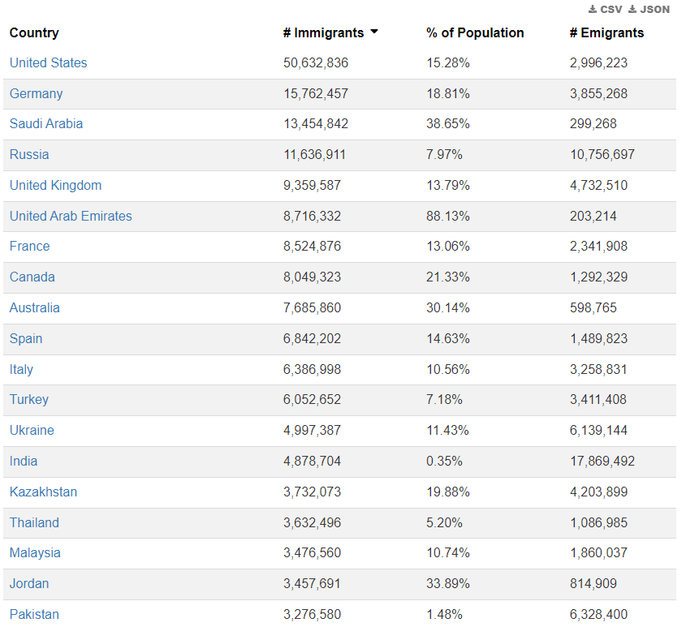
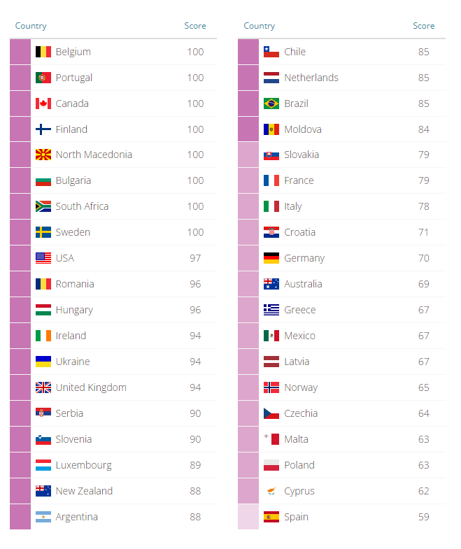
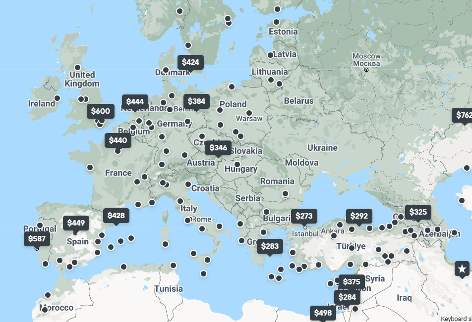
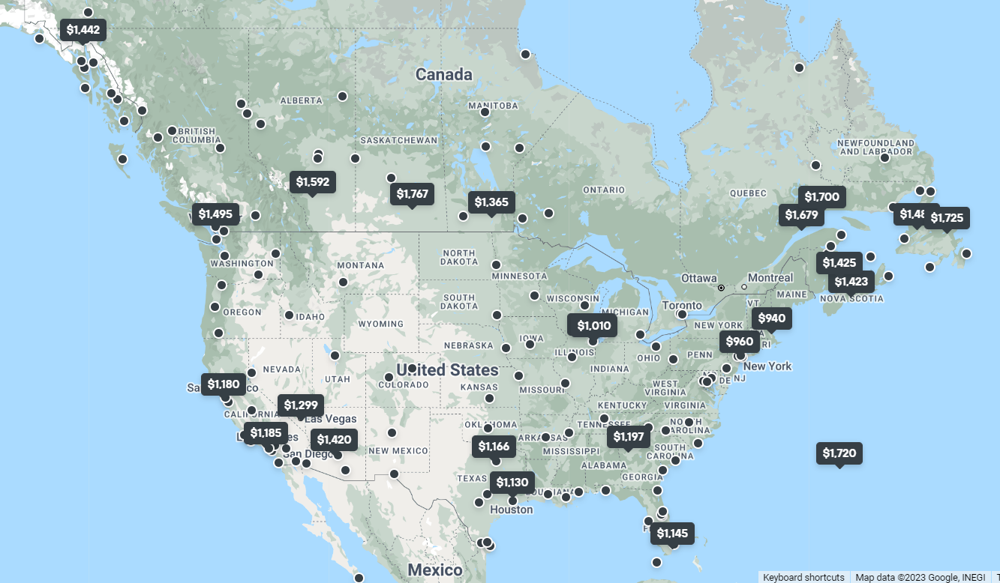
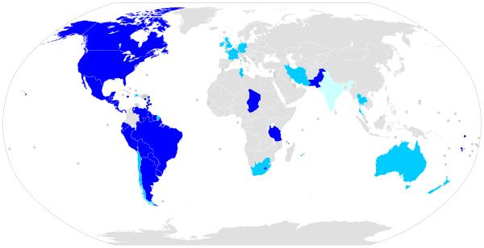

### مقدمه
قصد دارم در چند مطلب مجزا راجع به مباحثی که مدت‌هاست ذهنم رو مشغول کرده بنویسم. از این که مطلب زیادی طولانی شده عذرخواهی می‌کنم. شاید بهتر باشه بذارید برای وقتی که براتون مهم باشه و حوصله خوندن داشته باشید. 

مخاطب در همه این پست‌ها یک فرد عادیه که هیچ آشنایی‌ای با مهاجرت نداره. دقیقا انگار دارم با نسخه دو سال پیش خودم صحبت می‌کنم. 

این مطالب رو نوشته بودم که بعدها منتشر کنم. شاید یک سال بعد از این که تونستم پذیرش بگیرم ولی گفتم شاید به درد بقیه هم بخوره. پس فعلا به همین شکلی که هست منتشر می‌کنم و قبلش میگم که من تجربه مهاجرت ندارم و اینها صرفا افکار مکتوب منه. 

در اینجا روی دو کلمه «مهاجر» و «ایرانی» تاکید دارم. روی «مهاجر» تاکید دارم چون شرایط و قوانین کشور با توجه به این که مهاجر یا شهروند باشید، براتون تفاوت خواهد داشت. روی «ایرانی بودن» تاکید دارم چون معیاری مثل فاصله از کشور مقصد و وجود سفارت در داخل کشور صرفا در ایران معنی‌دار هست. البته در پستی مجزا راجع به مقایسه کلی کشورها خواهم نوشت. 

## معیارهای مقایسه
بعد از مدتی گشت و گذار در اینترنت، این سایت رو پیدا کردم که خیلی خوب کشورهای مختلف از نظر یک مهاجر خارجی (نه لزوما ایرانی) بررسی کرده و کشورهای مشابه به ده دسته تقسیم‌بندی شده‌اند. [MAIN FINDINGS | MIPEX 2020](https://www.mipex.eu/key-findings). در جاهای مختلف این پست جهت مقایسه به معیار Migrant Integration Policy Index (MIPEX) ارجاع خواهم داد. 

خب بریم سراغ معیارهایی که از نظر یه «مهاجر ایرانی» می‌تونه مهم باشه: 

### ۱- اقامت دائم (Permanent Residency)
سوالات مهم:
- بصورت میانگین چه مدت طول می‌کشه تا کشور به من، اقامت دائم بده؟ 
- آیا زمان تحصیل (در دوره دکتری) جزو زمان اقامت حساب میشه یا نه؟

همونطور که می‌دونید اجازه اقامت در یک کشور بصورت موقت و دائمی هست. اجازه حضور موقت در کشور به «ویزا» تعبیر میشه. ما معمولا با ویزای کاری یا تحصیلی وارد یه کشور می‌شیم و بعد از اتمام درس یا کار بعد از مدتی محدود (معمولا شش ماه تا یک سال) باید کشور رو ترک کنیم مگر اینکه دوباره ویزا بگیریم. اینجاست که بحث اقامت دائم یا اقامت (یا PR) اهمیت پیدا می‌کنه. کسی که اقامت دائم داره، می‌تونه تو کشور ول بچرخه و کسی دیگه بیرونش نمی‌کنه. البته ممکنه با خروج‌ از کشور به مدت طولانی اقامت‌تون باطل بشه. 

این یادداشت رو اقای ... در لینکداین‌شون گذاشتند: 
> حالا به عنوان یک ایرانی شما حتما به فکر اقامت دایم و پاسپورت افتادین و باید بدونین کشورها تو این زمینه به سه دسته تقسیم میشن:
>۱- کشورهای پولی مثل دومینیکن و ترکیه که یه پولی سرمایه گذاری میکنی و گاهی چند روزه پاسپورت‌شون رو میگیری. البته این پول انقدر واسه یه ایرانی الان بزرگ شده که تقریبا غیر ممکنه.
>۲- کشورهای امتیازی که شما برا گرفتن اقامت دائم‌شون می‌تونین با بدست آوردن یک سری امتیاز حتی بدون اینکه تو اون کشور حضور داشته باشید، اقدام کنین مثل کانادا، امریکا، استرالیا و نیوزیلند.
>۳- کشورهای زمانی که شما باید یک زمان خاصی رو توی اون کشور زندگی کنید و مالیات پرداخت کنین تا بتونین اقامت دائم بگیرید. بیشتر کشورهای اروپایی این‌طوری هستند.

مشخصا آلمان و هلند با پنج سال کار اقامت میدن ولی تو کشوری مثل سوئیس یا دانمارک این مدت تقریبا ده سال هست. در مورد کشورهای امتیازی هم میشه یه تخمین ازشون داشت. مثلا برای کانادا میگن با دو، سه سال کار معمولا امتیازتون انقدری میشه که بشه برای اقامت درخواست داد یا مثلا برای آمریکا، اقامت دائم رو میشه با NIW گرفت که اگر تشخیص بدن محقق موثری هستید، بهتون تعلق می‌گیره. معمولا بچه‌ها میگن که باید فلان قدر citation بگیری که بعد دکترا بتونی درخواست گرین کارت بدی.  ([+](https://www.chaolaw.com/niw-citations.html)). اقامت دائم در آمریکا رو با نام گرین کارت (Green Card) می‌شناسند. ([Green Card | USCIS](https://www.uscis.gov/green-card)). 

یک سوال مهم دیگه‌ای که برای بچه‌هایی که تحصیلی میرن اهمیت پیدا می‌کنه اینه که آیا کشور، مدت زمان تحصیل رو جزو مدتی که باید در کشور باشید تا اقامت دائم بگیرید، به حساب میاره یا نه؟ مثلا تو هلند، چهار سال دکترا، کار حساب میشه و بعد از پنج سال کار کردن میشه، درخواست اقامت دائم داد. طبق یه قاعده کلی اون‌هایی که تو دوره دکترا حقوق میدن، مدت زمان تحصیل رو هم کار حساب می‌کنند ولی اونهایی که بورسیه میدن نه. البته استثنا هم داره: مثلا سوئیس با این که حقوق میده ولی مدت زمان تحصیل رو جزو اقامت حساب نمی‌کنه. 

در اینجا هم لینکی برای مقایسه کشورهای مختلف از نظر PR قرار میدم. این نمودار خیلی information زیادی نمیده. فقط در همین حد که کشورهایی که تو ستون سوم هستند، از نظر این معیار ضعیفن. علت این که این وب‌سایت رو اینجا قرار میدم اینه که کشوری که می‌خواید برید رو داخل وب‌سایت بزنید و دلایلی که امتیاز کم یا زیاد گرفته رو ببینید. 
- [Permanent Residence | MIPEX 2020](https://www.mipex.eu/permanent-residence)
- [مقایسه کشورها | گروه روت](https://rootgp.com/%d8%b1%d8%a7%d9%87%d9%86%d9%85%d8%a7%db%8c-%da%a9%d8%b4%d9%88%d8%b1%d9%87%d8%a7/%d9%85%d9%82%d8%a7%db%8c%d8%b3%d9%87-%da%a9%d8%b4%d9%88%d8%b1%d9%87%d8%a7/#1)

### ۲- شهروندی (Citizenship - Naturalization)
معمولا اخذ شهروندی بعد از اخذ اقامت دائم هست و گرفتنش راحت‌تره. با اخذ شهروندی - تابعیت - شما قانونا مثل بقیه افراد عادی اون کشور می‌شید مثلا می‌تونید رای بدید. مهم‌تر از اون پاسپورت می‌گیرید و می‌تونید با اعتبار اون پاسپورت رفت و آمد کنید. 

از طرفی شهروندی (بر خلاف اقامت) با خروج از کشور باطل نمی‌شه و می‌تونید به مدتی که می‌خواید برید و بیاید. فقط بعضی کشورها (مثل سنگاپور)، شرط می‌ذارند که اگر بخواید شهروندی اونا رو بگیرید، باید شهروندی ایران‌تون رو ابطال کنید. (در واقع Dual Citizenship رو قبول ندارند). با ابطال شهروندی ایران، دچار مشکلاتی از قبیل عدم اجازه مالکیت و حساب و ارث و اینها میشید.

من یه مقاله راجع به این موضوع پیدا کردم ولی اینطور چیزها رو بهتره برای هر کشور جداگانه جستجو کنید چون ممکنه سایت‌ها اطلاعات‌شون اپدیت نباشه. 

[Countries That Don't Recognize Dual Citizenship - Blog - Karibi Second Citizenship](https://karibi.com/en/countries-dont-recognize-dual-citizenship/)

شهروند اتحادیه اروپا رو با EU Citizen می‌شناسند. فوایدش نسبت به شهروند یک کشور
ویزای شینگن

به فرآیند تبدیل یه آدم عادی به شهروند، Naturalization یا بومی‌سازی گفته میشه. اگر همین کلید واژه رو در کنار اسم کشور سرچ کنید می‌تونید راجع به شهروندی اون کشور اطلاعات بدست بیارید چون اینطور مسائل کشور به کشور فرق داره. حتی ممکنه یه کشوری جدول امتیازات داشته باشه و اینطوری نیست که فقط یک زمانی لازم باشه تا بتونید شهروندی رو بگیرید ولی اگر بخوایم معیار در بیاریم مجبوریم قدری ساده‌سازی کنیم و حداقل مدت اقامت در کشور تا درخواست شهروندی رو یک معیار در نظر بگیریم. این عدد برای کشوری مثل هلند یا آلمان،  تقریبا پنج سال هست. 

این سایت ([Passport Cards - Reach Immigration](https://reachimmigration.com/en/passport-index/cards)) معیاری برای نشون دادن ارزش پاسپورت کشورهای مختلف تعریف کرده و رنک بندی کرده. 

همچنین در اینجا به کشورها از نظر آسونی اخذ شهروندی امتیاز داده. [Access to Nationality | MIPEX 2020](https://www.mipex.eu/access-nationality) ولی من همچنان ترجیح میدم برای اقامت و شهروندی همون معیار سال رو در نظر بگیرم چون امتیاز صرف بهم دید خاصی نمیده. 

### ۳- مهاجر‌پذیری
این معیار برای کسی که می‌خواد یه کشور دیگه زندگی کنه واقعا مهمه. 

با این که شعار تقریبا همه کشورها اینه که «ما از تنوع استقبال می‌کنیم و نژاد، جنسیت و دین اصلا هیچ‌ تاثیری نداره» ولی این که تا چه حد به این حرف عمل می‌کنند در هر کشوری فرق داره. اینجا می‌خوایم بسنجیم در هر کشوری چقدر شهروند درجه دو هستیم.

اگر بخوایم برای میزان مهاجرپذیری معیار در بیاریم که ملموس‌تر بشه، اولین معیار «تعداد افراد مهاجر» خواهد بود که تو تصویر زیر کشورهای با بیشترین مهاجر (Immigrant) مشخص هستند. 

فقط دقت کنید که «Emmigrant» با «Immigrant» فرق داره. Emmigrant به کسی میگن که از کشورش خارج میشه و به جای دیگه‌ای مهاجرت می‌کنه (مثلا ما ایرانی‌ها که از ایران خارج شدیم) ولی Immigration به کسی میگن که به کشور دیگه‌ای به عنوان مهاجر وارد شده (مثلا وقتی ما به کانادا میریم). معانی این دو تا کلمه بسته به زاویه دیدتون متفاوت هست.  
- [Immigration by Country 2023](https://worldpopulationreview.com/country-rankings/immigration-by-country)
- [Countries with the Highest (and Lowest) Proportion of Immigrants](https://www.visualcapitalist.com/countries-with-the-highest-proportion-of-immigrants/)
- [10 Most popular countries for Immigration - Best Citizenships](https://best-citizenships.com/2021/09/29/10-most-popular-countries-for-immigration/)

به جز «تعداد مهاجرین»، بسیاری سایت معیارهایی برای «تبعیض نژادی» و «برابری نژادی» تعریف کردند. مثلا سایت MIPEX معیار به نام «anti-discrimination» تعریف کرده که هر چه بالاتر باشد بهتر است. 

سایت‌های دیگر هم کار مشابهی رو انجام دادند ولی من کلام کوتاه می‌کنم و صرفا لینک‌شون رو میارم که اگر دوست داشتید استفاده کنید:
-  [Anti-discrimination | MIPEX 2020](https://www.mipex.eu/anti-discrimination)
- [Best Countries for Racial Equality | U.S. News](https://www.usnews.com/news/best-countries/best-countries-for-racial-equality)
- [Racial Discrimination Survey - Table - IndexMundi Surveys](https://www.indexmundi.com/surveys/results/8/table)

با کنار هم قرار دادن معیارهای گفته شده تخمین بهتری از وضعیت مهاجرپذیری کشورها بدست خواهید آورد. 

> با یکی از اساتید صحبت می‌کردم می‌گفت، اگر بتونیم بسنجیم که یک مهاجر چقدر در بازار کار رشد می‌کنه و می‌تونه بالا بره معیار خوبی می‌تونه باشه. مثلا مشخصا آمریکا مسئله‌ای راجع به این قضیه نداره. حتی هد تیم گوگل هم یه هندی انتخاب شد ولی خب مثلا تو آلمان نمیشه انقدر رشد کرد. 

### ۴- نزدیکی فرهنگی
تو بعضی فرهنگ‌ها ساده‌تر میشه دوست پیدا کرد. ساده‌تر میشه با مردم عادی تو کوچه خیابون گرم گرفت. مردم با هم راحت‌ترن. از طرفی مردم بعضی فرهنگ‌ها سردن. خشکن. دوست شدن باهاشون انقدر ساده نیست. 

مثلا سخت‌ میشه با یه آلمانی دوست صمیمی شد. اصلا ویدئوهای یوتیوب‌شون رو ببینید، طرف انگار انقدر انرژی نداره. از طرفی کشوری مثل مکزیک، مردم انگار با هم راحت‌ترند. فرهنگ ایران هم به نسبت گرمه. مهمون نواز هستیم. فامیل و دوست و آشنا برامون مهمه. من خودم وقتی میرم نانوایی نون بخرم، معمولا با یکی گرم صحبت میشیم و در مورد هر چیزی حرف می‌زنیم. مطمئن نیستم همچین کاری تو سوئد قابل انجام باشه!
 
در نگاه اول به نظر میاد این عامل با میزان مهاجرپذیری یکی باشه ولی من اینطور تعریف نمی‌کنم. من مهاجرپذیری رو بیشتر منعطف به قوانین کشور می‌دونم. این که چه امکاناتی به مهاجر میدن و تا چه اندازه بصورت قانونی، بهش حق و حقوق میدن. اینها قابل سنجش هستند اما نزدیکی فرهنگی چیزی نیست که بشه اندازه گرفت (یا حداقل من بلد نیستم).

فکر می‌کنم یه مسئله که به شدت با «گرم بودن و معاشرتی بودن» مردم ارتباط داره. انگار تو آب و هوای گرم مردم گرم ترند! داخل ایران هم میشه دید. مثلا اهوازی‌ها مردم خیلی مهمون‌نواز و اجتماعی‌ای هستند یا مثلا مکزیکی‌ها به نظر آدم‌های اجتماعی‌تری میان. از طرفی سوئدی‌ها نسبتا سرد ترن.

از یه جنبه هم میشه این مسئله رو فهمید. وقتی هوا سرده و برف جلوی خونه رو گرفته اصلا نمیشه از خونه بیرون رفت. با کی می‌خواید معاشرت کنید اصلا؟ وقتی ارتباط مردم با هم کم میشه انگار روابط اجتماعی تضعیف میشه.

اینجا فقط به سایتش اشاره می‌کنم و تو قسمت بعد بخش آب و هوا بیشتر توضیح میدم. 

[The Weather Year Round Anywhere on Earth - Weather Spark](https://weatherspark.com/)

### ۵- هزینه مسافرت به ایران
هزینه مسافرت به ایران دو بخش داره: هزینه رفتن به فرودگاه + هزینه پرواز

تو کشورهای اروپایی هزینه رفتن به فرودگاه ناچیزه ولی تو جایی مثل کانادا بسته به شهری که داخلش هستید این هزینه ممکنه خیلی زیاد بشه. حتی ممکنه این هزینه از هزینه پرواز بیشتر بشه.

مشخصا هر چی هزینه بیشتر باشه کمتر می‌تونید به ایران سر بزنید. 

اطلاعاتی که میگم رو از سایت [Search Flights, Hotels & Rental Cars | KAYAK](https://www.kayak.com/) استخراج کردم و مبلغ رو بر اساس دلار آمریکا (USD) گزارش می‌کنم. مبدا همه پروازها رو «فرودگاه امام‌خمینی تهران» (IKA) می‌زنم و مقصد رو متفاوت می‌زنم. در ضمن مبلغ‌هایی که نوشتم برای یک پرواز رفت هست (نه رفت و برگشت).

|      مقصد       |    ‌ رنج مبلغ     |
|:---------------:|:-----------------:|
| فرانکفورت آلمان |  ۵۰۰ تا ۷۰۰ دلار  |
|   بیسل سوئیس    |  ۴۰۰ تا ۷۰۰ دلار  |
|  آمستردام هلند  |  ۵۰۰ تا ۷۰۰ دلار  |
|  تورنتو کانادا  | ۱۱۰۰ تا ۱۵۰۰ دلار |
|   کبک کانادا    | ۱۴۰۰ تا ۱۷۰۰ دلار |
| نیویورک آمریکا  | ۹۰۰ تا ۱۱۰۰ دلار  |
|  میامی آمریکا   | ۱۴۰۰ تا ۲۲۰۰ دلار |
| سیدنی استرالیا  | ۲۴۰۰ تا ۳۱۰۰ دلار |
|                 |                   |

عکسی از قیمت پروازها از مبدا ایران در طول یک بازه تقریبا سه ماه (عکس رو می‌تونید از سایت www.kayak.com دقیق‌تر ببینید):

خیلی از این پروازها رو میشه لحظه آخر یا با تخفیف‌های دانشجویی خرید ولی به نظرم تو تصمیم‌گیری بهتره همیشه میانگین یا میانه رو مدنظرمون قرار بدیم. کلا تو آمار این دو تا معیار رو بیشتر از هر معیار دیگه‌ای دوست دارم. مخصوصا به نظرم میانه همواره نمایانگر بهتری از جمعیت هست چون میانگین خیلی متاثر از داده‌های پرت تو جمعیت میشه ولی میانه نه. مثلا درآمد بیل گیتس یا ایلان ماسک، میانگین درآمد آمریکایی‌ها رو به طرز قابل توجهی افزایش میده ولی روی میانه هیچ تاثیری نداره. نباید هم داشته باشه چون عملا داده پرت محسوب میشه. 

با کنار هم قراردادن این داده‌ها میشه گفت بلیط اروپا به طرز قابل توجهی از کانادا و آمریکا ارزون‌تره و همه اینها از استرالیا ارزون‌ترند. واقعا دیدن خانواده برای اونی که میره استرالیا مسئله بزرگی باید باشه چون رفت و برگشت یه نفر چیزی حدود ۵، ۶ هزار دلار آمریکا هزینه برمیداره و اگر زوج باشند ۱۱، ۱۲ هزار دلار میشه.  

عملا این معیار باعث میشه کسی که آمریکا میره نتونه برای حداقل چهار، پنج سال برگرده ایران. 

با درآمدهای معمول این عدد مبلغ بزرگیه. 

بالاخره یک چیزی هست که تو داک اپلای شریف، اسم یه دونه دانشگاه استرالیایی هم پیدا نکردم که بچه‌ها سال‌های قبل رفته باشند. داک اپلای شریف، یه شیت داخل گوگل شیت هست که بچه‌های شریف برای اشتراک‌گذاری اطلاعات بین خودشون استفاده می‌کنند. یعنی اینطوری خیلی ساختار یافته از بقیه دوستانشون خبر دارند که کجاها اپلای کردند، چقدر هزینه دادند، از چه افرادی ریکام گرفتند و خیلی اطلاعات دیگه. تا اونجا که خبر دارم داک هر سال بعد از اومدن نتایج اپلای بچه‌ها، پابلیک میشه و همه می‌تونند نگاه کنند. شاید بعدا داک پابلیک شده ۲۰۲۲ رو قرار بدم که استفاده کنید. ؟؟

؟؟

یک موضوع دیگه هم ساعت پرواز هست که برای هر کشوری متفاوته ولی با توجه به این که اکثر پروازهای ما تو ایران مستقیم نیست و باید به قطر یا ترکیه بریم و از اونجا پرواز دوم سوار بشیم، از این عامل صرفنظر می‌کنم چون به نظرم انقدر مهم نیست. 

البته می‌دونم که رنج حقوق آمریکا، کانادا، استرالیا و اروپا بسیار متفاوته و این عامل می‌تونه تاثیرگذار باشه. کما این که تو آمریکا رنج حقوق یه برنامه‌نویس می‌تونه مثلا ۱۵۰ هزار دلار در سال بشه که با کسر مالیات مثلا بشه سالانه ۱۲۰ هزار دلار. تقریبا میشه گفت عمرا همچین حقوقی رو بتونید تو اروپا پیدا کنید چون اروپا معمولا انقدر مالیات می‌گیرن که حقوق همه تقریبا یکی بشه. 

ولی اگر نظر شخصی من رو بخواید، هزار دلار همه جای دنیا هزار دلاره. درکی که من از هزار دلار دارم یکیه. با هزار دلار همه جا میشه مک بوک معمولی یا آیفون خرید. اینه که شاید حتی حقوق بیشتر باشه ولی ارزشی که ما به پول میدیم کمتر نمیشه. مثلا شاید اگر کسی سالی ۵۰۰ هزاردلار در سال هم دربیاره احتمالا خرج یه خونه بزرگتر و ماشین بهتر و لوازم خونه بهتر می‌کنه تا این که بگه اوکی من سالی دو بار برمی‌گردم ایران خانواده رو ببینم. 

### ۶- ویزای الحاق (Family Reunification visa or Family Reunion visa)
تقریبا همه کشورها شرایطی رو در نظر می‌گیرند که افراد خانواده بتونند دوباره در کنار هم جمع بشن به این فرآیند اصطلاحا Family Reunification میگن. به این نوع ویزا، ویزای همراه یا ویزای الحاق (به خانواده) هم میگن. 

 سوالات مهمی اینجا وجود داره: 
- آیا ویزای همراه همزمان هست؟ 
- اجازه کار به همراه داده میشه یا نه؟
- چقدر طول می‌کشه تا ویزای همراه صادر بشه؟
- آیا لزوما دو نفر باید ازدواج کرده باشند؟ 

ویزای همراه همزمان هم معمولا اینطوریه که یه شرطی وجود داره که تا خودتون نرید اونجا حائز اون نمی‌شید. مثلا بلژیک میگه باید نامه شهرداری رو داشته باشید. خب این به طور ضمنی همزمان بودن رو کنسل می‌کنه. این مورد رو باید تو گروه‌های اپلای بپرسید. 

برای درخواست ویزای همراه معمولا یک فرآیندی به نام Legalization باید طی بشه که مدارک ازدواج رسما ترجمه بشن. 

معمولا مدارک ازدواج (اگر لازم باشه)، نیاز هست که Legalize بشن که هزینه خوبی در بر داره. 

[Everything you need to know about F-2 visas](https://www.novacredit.com/resources/f2-visa/)

ویزای تحصیلی در آمریکا معمولا F1 هست و ویزای همراه F2 میشه. با ویزای F2 نمیشه کار کرد. اینه که معمولا می‌بینم بچه‌هایی که با پارتنر میگن آمریکا، هر دو نفر میرن درس می‌خونند. 

معمولا تو کشورهای اروپایی با ویزای همراه (چه کاری باشه چه تحصیلی)، میشه کار کرد مخصوصا در حالتی که برای PhD برید. دکترا در خیلی کشورهای اروپایی، شغل حساب می‌شه و شما عملا کارمند دانشگاه هستید. البته ترجیحا این مورد رو راجع به هر کشور جداگانه جستجو کنید.

چقدر ما ایرانی‌ها به درس خوندن علاقه داریم :))‌ 

مثلا ویزای همراه بلژیک اینجا هست که بهش ویزای D میگن. 
[Family reunion visas in Belgium: join a relative or partner | Expatica](https://www.expatica.com/be/moving/visas/family-reunion-and-spouse-visas-belgium-107646/#:~:text=Both%20permanent%20and%20temporary%20residence,for%20at%20least%20three%20months.)

برای مقایسه کلی هم سایت MIPEX معیاری برای Family Reunion معرفی کرده و راجع به هر کشور اطلاعات خوبی داده. 

[Family Reunion | MIPEX 2020](https://www.mipex.eu/family-reunion)

پیشنهاد جستجو: requirements for family reunification visa for country_name

### ۷- پروسه اخذ ویزا و نوع ویزا
پروسه اخذ ویزا برای کشورهای اروپایی معمولا خیلی راحت‌تره. برای ما ایرانی‌ها معمولا ویزای آمریکا، «در جا» نمیاد. معمولا وارد روالی به نام Clearance میشید که میانگین ۹۰ روز طول می‌کشه تا بررسی بشید که مشکل خاصی (از نظر امنیتی) ندارید. بعد از اون ویزاتون صادر میشه. 

ویزا بر دو نوع هست: Single-Entry و Multiple-Entry. ویزای سینگل مجوز یک بار ورود به کشور رو صادر می‌کنه و اگر به ایران برگردید، دوباره باید وارد پروسه دریافت ویزا بشید. ویزای مالتیپل اجازه چند بار ورود رو صادر می‌کنه. مخصوصا برای من مهمه که اگر مشکلی برای خانواده‌ام پیش اومد توانایی برگشتن پیش خانواده رو داشته باشم. 

من تا به حال راجع به کشور جز آمریکا نشنیدم که این مورد برای ما ایرانی‌ها مسئله‌ساز باشه. مثلا اگر کانادا یا هلند برید می‌تونید تو طول مدت تحصیل‌تون برید به خانواده سر بزنید و بیاید ولی تو آمریکا اکثر ویزاهای ما ایرانی‌ها سینگل صادر میشه. 

یه بار تو یه ویدئو از دکتر تفاق می‌دیدم که می‌گفت بعد پذیرش  MIT دلش خواسته برگرده ایران و برگشته. بعد دوباره سر فرآیند ویزا دادن کلی اذیت شده و یه ترم هم مرخصی گرفته تا بتونه دوباره به دانشگاه برگرده. 

[تحصیل در حوزه شینگن | ویزای تحصیلی شینگن | letsgouni](https://letsgouni.com/blog/schengen-student-visa)

از جمله مسخره‌بازی‌های دیگه آمریکا اینه که باید بگید که من نمی‌خوام تو آمریکا بمونم و آفسیر هم میگه چشم :)‌ معلومه که طرف می‌خواد بمونه. جفتشون هم می‌دونند که داره دروغ میگه ولی باز همینی هست که هست. 

با ترکیب عوامل دیگه (مثل نداشتن اجازه کار برای همسر) می‌تونید متوجه بشید که آمریکا انتخاب من نبوده و نیست. فعلا نظرم اینه که تا وقتی شهروند ایران هستم به آمریکا نمیرم. در کل هم از کشورش خوشم نمیاد. نگاهش زیادی سرمایه‌داریه و من با این که به بازار آزاد معتقدم ولی انقدر نگاه سرمایه‌داری رو در کل نمی‌پسندم. در ضمن اطلاعاتی که من در مورد آمریکا دارم خیلی دقیق نیست چون کشورش رو دوست نداشتم، زیاد در موردش تحقیق نکردم. 

نوع ویزای هم که بهتون میدن می‌تونه مهم باشه مثلا سوالی که وجود داره اینه که ویزای تحصیلی اجازه کار همزمان به فرد رو هم میده؟ اجازه خروج از کشور چی (Single vs Mutiple)؟ 

### ۸- وجود سفارت در ایران

سفارت داریم ولی کنسولگری نداریم. 
دو تا از پرطرفدارترین کشورهای ایرانی‌ها، آمریکا و کانادا هستند که داخل ایران سفارت ندارند پس دردسر مهاجرت به این دو تا کشور از این نظر قدری بیشتره و خب باید موضوع رو پذیرفت. برای کسی که مشکل سربازی نداره، این مورد صرفا منجر به دادن پول و وقت بیشتر میشه چون باید به یه کشور دیگه (معمولا ترکیه، دبی یا پاکستان) بره و از سفارت اونجا درخواست بده ولی برای کسی که سربازی داره خیلی مشکل‌تره.

برام عجیبه که برای کانادا این مورد دو طرفه هست یعنی داخل کانادا هم سفارت ایران نداریم. اگر کار خاصی داشته باشید باید مثلا برید سفارت ایران در آمریکا (!) و کارتون رو انجام بدید. 

برای بقیه کشورها این مورد تقریبا وجود نداره. اکثر کشورهای اروپا (حتی انگلیس) تو ایران سفارت دارند و می‌تونید کارهای سفارتی و اخذ ویزا و امثالهم رو از داخل تهران پیگیری کنید. 

یک موضوع دیگه هم که باید در نظر بگیریم وقت (صف) سفارت هست. این مورد برای کانادا آمریکا معمولا خیلی طولانی‌تر از اروپا هست. مثلا برای آمریکا تقریبا باید شش تا نه ماه تو صف باشید و این عدد برای اروپا چیزی در حد چند ماه هست. 

[فهرست وابسته‌های دیپلماتیک در ایران - ویکی‌پدیا، دانشنامهٔ آزاد](https://fa.wikipedia.org/wiki/%D9%81%D9%87%D8%B1%D8%B3%D8%AA_%D9%88%D8%A7%D8%A8%D8%B3%D8%AA%D9%87%E2%80%8C%D9%87%D8%A7%DB%8C_%D8%AF%DB%8C%D9%BE%D9%84%D9%85%D8%A7%D8%AA%DB%8C%DA%A9_%D8%AF%D8%B1_%D8%A7%DB%8C%D8%B1%D8%A7%D9%86)

### ۸- یادگیری زبان سوم (و شایدم چهارم)
همون طور که می‌دونید زبان بین‌المللی و رسمی برای کار در صنعت یا آکادمیک، انگلیسی هست؛ یعنی هر کاری بکنید،‌ آخرش باید انگلیسی رو یاد بگیرید. با رواج کلاس زبان و دونستن اهمیت زبان انگلیسی، تقریبا همه کسایی که به مهاجرت فکر می‌کنند، یا در حال تقویت مهارت زبان انگلیسی هستند یا این که قبلا زبان رو یاد گرفتند. قاعدتا یه سری جاها برای ورود اگر مدرک زبان داشته باشید براشون مهم هست. اینجا در مورد تجربیاتم در مورد آزمون زبان نوشتم. 

زبان رسمی کشورهایی مثل کانادا، آمریکا، استرالیا و انگلیس (!)، انگلیسی هست. این موضوع کفه این کشورها رو سنگین‌تر می‌کنه. 

از طرفی زبان رسمی اکثر کشورهای اروپایی، انگلیسی نیست. در ضمن استان کبک در کانادا، زبان رسمیش فرانسه است. اینجاست که باید یک زبان سوم یاد بگیرید. احتمالا تو دانشگاه و صنعت با همون انگلیسی کارتون راه میافته ولی هر کاری بکنید، نمی‌تونید زیرش در برید. بالاخره اگر می‌خواید جایی بمونید، باید زبان رسمی کشور رو بپذیرید و یاد بگیرید. مثلا بعضی مغازه‌دارها یا تاکسی‌‌ها در آلمان فقط آلمانی بلدن! 

این موضوع هم صفر و صدی نیست و یک طیف داره ولی نهایتا یکی از شروط اکثر کشورها هنگام دادن شهروندی اینه که زبان اون کشور رو تا اندازه معقولی بلد باشید. این موضوع تو کانادا با آزمون‌های رسمی (ایلتس و تافل) مشخص میشه و تو هلند با یه آزمون دیگه. 

خلاصه نمیشه از زیر این موضوع در رفت و بالاخره اگر بخواید یه جا زندگی کنید بدیهیه باید زبان مردم عادیش رو هم یاد بگیرید. البته نمی‌خواد یاد بگیرید انشاء بنویسید و مثلا با ادبیات آلمانی آشنا بشید. در حدی که بتونید با مردم صحبت کنید و مثلا تو مغازه بتونید بگید چی‌ می‌خواید. 

راجع به زبان چهارم گفتم چون تو بعضی کشورها مثل سوئیس، زبان مردم هر منطقه‌ای می‌تونه متفاوت باشه. اینجاست که شاید مجبور بشید علاوه بر یادگیری زبان سوم، هنگام تعویض خونه، به یادگیری زبان چهارم فکر کنید. 

شاید اولش فکر کنید که این موضوع می‌تونه مزیت باشه. مثلا بگید «چه خوب که من سه تا زبان بلدم.» به نظرم اینها تاثیر تبلیغات تلویزیونی و ماهواره‌ای هست که میگن «ببینید طرف به ۲۵ تا زبان رایج دنیا مسلط هست». اولا این که تعریف تسلط بر زبان اونطور که تو استوری ایسنتاگرام گفته میشه با تعریف من فرق داره. اونها ممکنه صحبت کردن عادی در حد صرفا سلام و علیک رو تسلط بدونند اما تسلط به نظر من بالاترین سطح دانش زبانی هست و با معیار من ممکنه خیلی از ماهایی که فارسی صحبت می‌کنیم هم تسلط به فارسی نداشته باشیم! مثلا در مورد خودم با این که سال‌ها انگلیسی رو از طرق مختلف و رسانه‌های مختلف مطالعه کردم و کلاس رفتم، باز هم نمیگم مسلط به انگلیسی هستم ولی میگم می‌تونم به راحتی انگلیسی حرف بزنم و منظورم رو منتقل کنم.

دید من نسبت به زبان کاملا ابزاری هست، ما زبان رو یاد می‌گیریم که با یکدیگر ارتباط برقرار کنیم. همین. یادگیری زبان به خودی خود ارزشمند نیست صرفا یه ابزار ارتباطیه. باید ازش استفاده کرد تا کار پیش بره. همون طور که تو بحث برنامه‌نویسی نمیگیم کسی که به تمام زبان‌های برنامه‌نویسی کد می‌زنه خفنه. اصلا کسی نیاز نداره همچین کاری رو بکنه. بسته به نیازش یک یا دو زبان رو یاد می‌گیره و با همون‌ها کارش رو برطرف می‌کنه.

تو همچین نگاهی که زبان کارکرد ابزاری داره یادگیری زبان یه مسئله حداقلی میشه و هدف برقراری ارتباط به بهترین شکل ممکنه. تو این حالت من نوعی خیلی راحت ترم تمام مکالماتم رو به زبان انگلیسی (یا هر چیز دیگری) انجام بدم و لازم نباشه دوباره وقت صرف کنم که زبان جدید یاد بگیرم. 

اگر یادگیری زبان سوم یا چهارم توسط همه مردم، کار ارزشمند و مفیدی بود، احتمالا در آگهی‌های کاری میدیدیم که مثلا می‌گفتند آشنایی با Dutch، English ، French و German مزیت محسوب میشه. من شاید بین ۱۰۰۰ تا آگهی تو رشته خودم، یک اگهی به این صورت دیدم. با این حال اگر رشته شما به گونه‌ای هست که اینها مزیت محسوب میشه خیلی هم خوبه. 

کما این که این زبان برای کشور دیگری فایده نداره. اگر زمانی تصمیم بگیرید از آلمان به کانادا برید، تقریبا بلدبودن زبان آلمانی هیچ کمکی بهتون نمی‌کنه. 

[List of countries by English-speaking population - Wikipedia](https://en.wikipedia.org/wiki/List_of_countries_by_English-speaking_population)

لیستی مثل لیست بالا نشون میده که هر کشور چقدر انگلیسی زبان داره و چقدر می‌تونید تو مکالمات روزمره از انگلیسی صحبت کنید. هر چند نهایتا زبان کشور مقصد رو باید یاد بگیرید. 

### ۹- بقیه معیارها
سایت MIPEX، کشورها رو از نظر معیارهای دیگه‌ هم بررسی کرده. مثلا در نظر گرفته که کشور چقدر به آموزش مهاجر بها میده؟ چقدر به سلامت مهاجرینش رسیدگی می‌کنه؟ یه مهاجر چقدر به بازار کار به اندازه بقیه دسترسی داره؟ 

در اینجا چون خودم به شخصه حرف خاصی ندارم صرفا به سایت ارجاع میدم که خودتون برید مطالعه کنید. تو قسمت Policies، هشت معیار گذاشته که از این نظر کشورها رو با هم مقایسه کرده. 

[MAIN FINDINGS | MIPEX 2020](https://www.mipex.eu/key-findings)

### معیارهای من
احتمالا باید قسمتی جدید برای این مطلب بگذارم. 
یه سری چیزای کلی رو گفتم که ممکنه برای هر فرد مهم باشه یا نباشه. برای من چه چیزهایی مهم بوده؟

معیارهای مهم برای من اقامت و شهروندی هستند. کشورهای اقامت یا شهروندی طولانی دارند رو کلا حذف کردم (دانمارک و سوئیس). 

به نظرم یکی از مهم‌ترین معیارها در انتخاب کشور همین مدت و شرایط اقامت دائم هست. خیلی بده که مهاجرت کنیم و بعد اتمام تحصیلات یا کار، نتونیم کار پیدا کنیم و دست از پا درازتر به ایران برگردیم. به طور خاص، برگشتن به ایران رو چیز بدی نمی‌دونم و ممکنه در آینده تصمیم بگیرم به ایران برگردم ولی از نظر خودم این که من تصمیم بگیرم می‌خوام به ایران برگردم با این که من رو از اون کشور بیرون کنند، زمین تا آسمون تفاوت داره. 

در مورد پاسپورت
احتمالا همین مورد مهم‌ترین چیز برای من و شما هست. احتمالا من خودم اگر به یه کشور دیگه برم آخرین دغدغه‌ام اینه که می‌تونم رای بدم یا نه ولی پاسپورت خیلی مهمه؛ چون مثلا وقتی پاسپورت اروپا رو بگیرید به بسیاری از کشورها بدون ویزا می‌تونید سفر کنید و آپشن خیلی جذابی محسوب میشه. 

اینجا ویزای همراه همزمان برای من اهمیت پیدا می‌کنه. از طرفی انقدر مهم‌ نیست که کشوری (مثل آلمان) رو بخاطرش حذف کنم. از طرفی کم اهمیت هم نیست و تو اولویت‌بندی کشورها برام تاثیرگذاره. مثلا آلمان میگه: «برای ویزای همراه باید از داخل کشور آلمان برای پارتنر درخواست بدید» ولی هلند میگه «اوکیه، با هم بلند شید بیاید». 

کشورهایی که اقتصادشون خیلی ضعیفه هم حذف کردم. هر چی موند اپلای کردم و حالا به نسبت امتیازی که با معیارهای مختلف بدست میاره، اولویت بندی کردم. 

کانادا آمریکا رو حذف کردم چون هم دورن، هم پولی که تو دوره دکترا میدن برای دو نفر کمه. 

نوشتن در مورد این معیارها بیشتر برای ساختاردهی به ذهن جهت تصمیم‌گیری بوده. نهایتا بعضی از این معیارها برای من کمترین اهمیتی نداره ولی خب دونستن‌شون مهمه چون با توجه به شرایط ممکنه برای یک نفر اتفاقا اولویت اول باشه. 

فاصله از ایران
وقتی این عامل در کنار عامل فاصله یا هزینه بلیط هواپیما میاد عملا آمریکا رو به کشوری تبدیل می‌کنه که وقتی برید تا مدت‌ها نمی‌تونید پیش خانواده‌تون برگردید و از قبل باید این موضوع رو با خودتون حل و فصل کرده باشید. فکر می‌کنم میشه گفت کسی که میره آمریکا باید به نسبت وابستگی خانوادگی کمتری داشته باشه که بتونه دوری رو تحمل کنه. این تو شریف یه موضوع حل شده است و خیلی از بچه‌ها میگن «عوضش بعد تحصیل خیلی بیشتر پول درمیاریم» که خب البته درست میگن. بالاخره مثل همه تصمیم‌های زندگی یه trade-off عه که باید طرف‌تون رو مشخص کنید. بستگی داره یکی پول براش اهمیت بیشتری داره و یکی خانواده براش مهم‌تره. در مقابل کشوری مثل هلند اینطوری هست که می‌تونید تقریبا سالی یک بار به خانواده سر بزنید و مشکلی از این بابت وجود نداره. 

> مثلا یکی از اساتیدمون که آمریکا رفته بود، می‌گفت که «هنگام فوت پدر و مادرش نتونسته به ایران برگرده و خب براش مسئله‌ای نبوده». این موضوع ممکنه برای یه نفر دیگه به اندازه‌ای مهم باشه که قید تحصیل و کار و همه‌چی رو بزنه، فقط برای این که بتونه خاکسپاری رو شرکت کنه. اینجاست که باز سلیقه فرد مهم میشه. 

## نکات 
### بحث مهاجرت دوم
بعضی‌ها میگن اول به یه کشور دیگه میریم که صرفا از ایران رفته باشیم، بعد از مدتی از همونجا درخواست میدیم و به یه کشور دیگه میریم. مثلا من اوایل می‌خواستم برم دانشگاه EPFL تو سوئیس دکترا بخونم و بعد از چهار سال، دوباره به کانادا مهاجرت کنم تا اونجا بتونم کار پیدا کنم و اقامت و شهروندی بگیرم. با این که این قضیه از نظر تئوری ممکنه و من دوستانی رو می‌شناسم که این کار رو کردند ولی باید توجه کنید که این کار به سادگی‌ای هم که فکر می‌کنید نیست. نه که از نظر حقوقی به مشکل بربخورید. 

تو هر کشوری کلی چیزها باید یاد بگیرید که خاص اون کشور و حتی اون منطقه خاص هست. بعد مدتی زندگی کردن در اونجا این اطلاعات رو بدست میارید مثلا این که کارت مترو رو باید کجا بذارم. کجا برم خرید کنم. بیمه چطوریه. خونه چطوره. کجا فلان چیز رو بخرم و کلی اطلاعات دیگه. با مهاجرت مجدد، عملا تمام این اطلاعاتی که قبلا بدست آوردید به درد نخور میشن و این بسیار سخته. 

### اصل خون یا اصل خاک (برای فرزند)
این رو صرفا جهت اطلاع می‌نویسم. به نظرم معیار تصمیم‌گیری نیست. 

اصل خون و اصل خاک دو تا روش مختلف برای دادن شهروندی به فرزند هستند. کشورهایی که از اصل خاک پیروی می‌کنند، میگن وقتی فرزندتون تو خاک ما به دنیا بیاد، شهروند حسابش می‌کنیم. اصل خون میگه: «مهم نیست کجا به دنیا بیاد، همین که خون شهروند ما در رگش باشه، بهش شهروندی میدیم». مثلا ایران از اصل خون تبعیت می‌کنه. هر جای دنیا بچه بیارید بازم به راحتی پاسپورت ایرانی می‌گیره و ایرانی حساب میشه. اکثر کشورهای اروپایی هم از اصل خون تبعیت می‌کنند. 

کانادا و آمریکا از اون طرف اصل خاک رو قبول دارند. علت این که خیلی از بازیگرها میرن بچه‌هاشون رو تو کانادا و آمریکا به دنیا میارند هم همینه. از این نظر برای ما ایرانی‌ها، کشورهایی که اصل خاک رو قبول دارند، جذاب‌تر هستند. بالاخره گرفتن شهروندی به طور میانگین پنج، شش سال طول می‌کشه و اگر تو این مدت فرزند بیارید، فرزندتون شهروند حساب نمیشه. 

اینطور که من فهمیدم نهایتا هر کشوری خودش می‌گه که برای بچه‌هایی که شهروند نیستند، چیکار باید بکنند و مثلا بعد ۱۸ سالگی دیگه تقریبا همشون با یه شرایطی شهروندی رو میدن ولی خب گرفتن شهروندی بصورت درجا مزیت خیلی خوبی هست. 
[اصل خون - ویکی‌پدیا، دانشنامهٔ آزاد](https://fa.wikipedia.org/wiki/%D8%A7%D8%B5%D9%84_%D8%AE%D9%88%D9%86)
[اصل خاک - ویکی‌پدیا، دانشنامهٔ آزاد](https://fa.wikipedia.org/wiki/%D8%A7%D8%B5%D9%84_%D8%AE%D8%A7%DA%A9)

### نکات نهایی

این رو باید بپذیریم که کشوری که از هر نظر کامل و پرفکت و مناسب شرایط ما باشه، وجود خارجی نداره. هر کشوری در کنار مزایاش یه سری معایب داره. یکی دوره، یکی آب و هواش بده، یکی وضع سلامتش جالب نیست، اون یکی دیر اقامت و شهروندی میده. 

 من نه وکیل مهاجرتی‌ام. نه قانون بلدم. نه اصلا تخصص در این زمینه دارم. یک چیزهایی برای خودم مهم بوده که اینجا نوشتم. هدف بیشتر این بوده که بتونم به اندازه سهم خودم کاری کنم که بحث‌ها در باب مقایسه کشورها کوتاه‌تر و و مفیدتر انجام بشه.

انقدر در اینترنت راجع به تک‌تک کشورها مطلب هست که واقعا نیازی به پرسش از من نیست. گوگل بهترین دوست ماست. 
اطلاعات راجع به هر کشور در این سایت هست. 
مثلا این یک سایت انگلیسی هست که در مورد بلژیک نوشته و اینجا هم بصورت فارسی در موردش توضیح داده شده. 
[کشور بلژیک](https://go2tr.co/belgium)

جزئیاتی که در مورد تک‌تک کشورها می‌نویسم ممکنه قدری با واقعیت مطابقت نداشته باشه و شرایط خاص‌تری هم داشته باشه ولی چون من می‌خوام بصورت جامع به بحث نگاه کنم، این شرایط رو در نظر نمی‌گیرم. مثلا، اقامت دائم در کانادا یک جدول خاص داره که امتیازبندی داره ولی چیزی که عرفا گفته میشه و بهش اهمیت میدن، همون حداقل تعداد سالی هست که باید اونجا کار کنیم تا بتونیم درخواست اقامت دائم بدیم. 

در کل چون این بحث‌ها قانونی هست بهتره تو سایت‌های تخصصی راجع به تک‌تکشون اطلاعات بدست بیارید و ترجیحا با وکیل هم مشورت کنید. هر کشور یه عالمه edge case داره که برای هر فرد خاص متفاوت میشه. من می‌خوام بگم که این معیارها وجود داره و باید بهش توجه بکنید. حالا راجع به تک‌تکش میشه کلی در اینترنت جستجو کرد. 

ما معمولا تو زمینه مهاجرت تو کشورمون دیتای خام خوبی نداریم. مخصوصا از جنس مکتوب شده. اینه که باید از اطرفیان بپرسیم و پرس و جو کنیم. عملا اینطوری وارد فازی میشیم که فقط افرادی می‌تونند مهاجرت کنند که شرط اولیه مهاجرت که همون دیتای خام باشه رو داشته باشند. تفاوت دیتای مکتوب با دیتای ویدئو اینه که دیتای مکتوب خیلی ساختار یافته‌تر نوشته میشه و حجم عظیمی از اطلاعات می‌تونه منتقل بشه در حالی که ویدئو اینطوری نیست. 

هدفم اینه که به جای این که تک‌تک افراد بصورت جداگانه و مستقل فکر کنند و به نتایجی برسند، مجموعه نوشته‌هایی رو بنویسم که برای شروع در این مسیر مفید باشه. احتمالا در اپلای کردن هر جا به طور خاص درگیر مسائل دیگه‌ای هم میشیم که جزئیاته ولی نگاه کل نگر در این مسئله مهمه. 

پیش فرض من اینه که شما مهاجرت تحصیلی یا کاری رو مد نظرتون هست. چیزی مثل مهاجرت از طریق سرمایه گذاری ممکنه خیلی متفاوت باشه. 

حتما معیارهایی که نوشتم ناقصن. نیاز هست که community بزرگواران خارج نشین، در این زمینه کمک کنند. چیزی که تو نظرم دارم اینه که داکیومنت‌های معیاری برای مهاجرت بوجود بیاد که اگر کسی خواست مهاجرت کنه سریع‌تر با بیسیک‌های مهاجرتی آشنا بشه. 

این مسائلی که میگم بیشتر از هر چیز، چهارچوبی (هر چند ناقص) برای فکر کردن میده. اطلاعات هر کدوم از لینک‌ها و پست‌ها ممکنه قدیمی بشن ولی شما روش جستجو کردن و بدست آوردن داده رو بلدید. با یک جستجوی ساده اطلاعات مدنظرتون رو بدست میارید. 

نکته ای که جاش اینجا نیست
بهتره قبل از مهاجرت یا حتی رفتن موقت از ایران، به پدر یا مادر یا یک فرد معتمد در ایران، وکالت تام‌الاختیار بدید که بتونه کارهای اداری‌تون در ایران رو پیگیری کنه. به نظرم چیز خیلی مهمی هست. 

[چک لیست موارد قبل از مهاجرت | ۲۵ مورد که باید به عنوان یک مهاجر بدانید - YouTube](https://youtu.be/Eb_Rep0Gn6Y)

منابعی برای مطالعه بیشتر
- [Fastest and Easiest Country to Get Second Citizenship 2023](https://immigrantinvest.com/blog/easiest-way-to-get-citizenship-en/)
- [Easiest Countries to Immigrate To 2023](https://worldpopulationreview.com/country-rankings/easiest-countries-to-immigrate-to)
- [Fastest and Easiest Country to Get Second Citizenship 2023](https://immigrantinvest.com/blog/easiest-way-to-get-citizenship-en/)

مراجع
اقای امین شهرکی در مجموعه‌ای از پست‌های لینکداین راجع به بعضی نکات صحبت کردند و مستقیما بهشون ارجاع دادم. بد نیست کل متن‌شون رو هم بخونید. 
[https://www.linkedin.com/in/amin-shahraki/](https://www.linkedin.com/in/amin-shahraki/)

صحبت‌های دوستانم در شریف. خیلی هم زیاد بوده. 

حرف‌هایی که میزنم الهام گرفته از صحبت با دوستانم هست و کاری که من انجام دادم اینه که سعی کردم همه اینها رو کنار هم قرار بدم. بسیاری از این حرف‌ها در جایی مثل شریف، common knowledge محسوب میشن و عجیب هست اگر ندونید! فقط احتمالا کسی حوصله‌ و وقتش رو نداره که مکتوبش کنه.  شاید انقدر چهارچوب نداشته باشه ولی اطلاعات رو همه دارند انگار. 

کلا از معیار تعریف کردن و کمی‌ و قابل سنجش کردن چیزها خیلی خوشم میاد. اگر این نباشه، راهی جز پرس و جو از یکی دو نفر اطرافمون (اگر بتونیم پیدا کنیم) نداریم و معمولا یکی دو نفر تجربیات خیلی محدودی دارند و تعمیم‌هایی که میدن زیاد درست نیست. راجع به اهمیت این معیار، فکر نمی‌کنم این معیار انقدر مهم باشه که باعث بشه کسی به کشوری مهاجرت نکنه ولی تو اولویت‌بندی کشورها مهم هست. 

سایت های خوب 
[گروه روت | انجمن مشاوره تخصصی با نخبگان](https://rootgp.com/)
