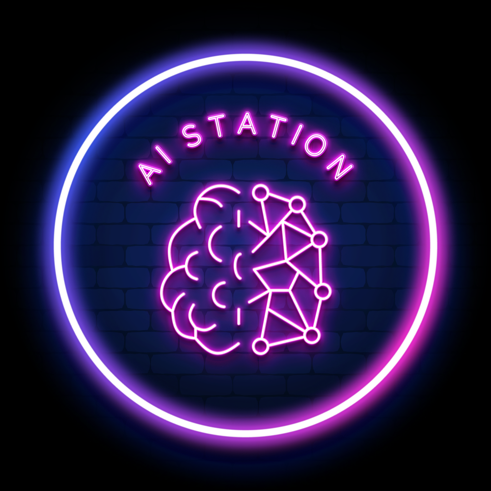

### معرفی

چند وقتی هست یک ایده تو سرم می‌چرخه. ایده اینه که یه سری مفاهیم هوش‌مصنوعی رو به زبان ساده و قابل‌فهم توضیح بدم. این ایده نقطه تولد «ایستگاه هوش‌ مصنوعی» هست.

قراره تو فصل اول یه سری مباحث مهم هوش‌مصنوعی رو با هم مرور کنیم و بعد از اون به روندها و اتفاقاتی که تو هوش مصنوعی می‌افته بپردازم. 
### لینک‌ها

- [Spotify](https://open.spotify.com/show/6TPjftO0GVSh6ztwqqEUxM)
- [Castbox](https://castbox.fm/ch/5618013)

این هم لوگوی زیبای پادکست که زحمت طراحی‌اش رو همسرم کشیده :) 

