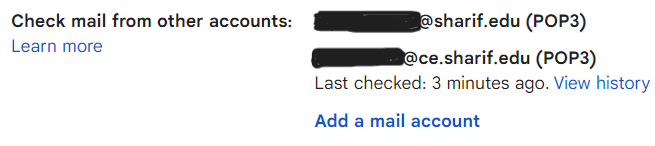
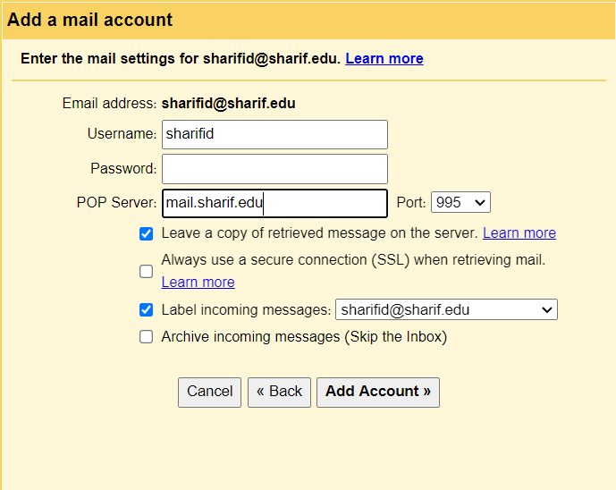

## سرعت اینترنت
تقریبا یه ساله دارم از اینترنت خوابگاه و دانشگاه استفاده می‌کنم و از اینترنتش راضیم. تقریبا بصورت میانگین ۱۶ مگابیت دانلود و ۵ مگابیت آپلود رو میده. در رابطه با اینترنت صرفا توقع دارم که بتونم ویدئو یوتیوب رو بدون معطلی ببینم و خب کافیه. 

کلا تو ایران یه توسعه نامتوازن اینترنت هم داشتیم. یعنی به طرز عجیبی بر خلاف همه دنیا، اینترنت موبایل خیلی بهتر از اینترنت خط ثابت هست. به این معنی که سرعت اینترنت موبایل تقریبا معادل میانگین سرعت جهانی هست و سرعت اینترنت ثابت بسیار بسیار کمتر از میانگین جهانی هست. مقصر اصلی هم به نظر من شرکت زیرساخت مخابرات هست که انحصار تو این حوزه رو در دست داره.

>‌ کلا از وقتی که اعتراضات در ایران شروع شده، چیزی به نام اینترنت تقریبا بی‌معنی شده. یه تماس صوتی ساده هم نمیشه گرفت و اکثر پکت‌ها دراپ میشن. به هر حال ترجیح میدم تو این وبلاگ صرفا در مورد مسائل فنی بنویسم. به مرور زمان فهمیدم که امثال من حتی اگر کار سیاسی بکنند زیاد موثر نخواهد بود چون بازیکن‌های بسیار مهم‌تری تو شبکه‌های اجتماعی وجود دارند. من اگر هم بخوام تاثیرگذار باشم، صرفا در ناحیه فنی و تخصصی خودم باید باشه. 

## اسکریپت لاگین
من مدت‌هاست یه [اسکریپتی](https://gist.github.com/pourmand1376/965625a56c9e8ba4a82cd6f7dd98ed80) نوشتم که لاگین داخل دانشگاه رو با ترمینال انجام میده. اسکریپت bash هست که روی لینوکس و مک بصورت native کار میده. روی windows با نصب [WSL](https://learn.microsoft.com/en-us/windows/wsl/install) کار میده و روی اندروید با [Termux](https://play.google.com/store/apps/details?id=com.termux&hl=en&gl=US) جواب میده. 



روش پیشنهادی من اینه که یه فایل به نام مثلا ‍`.sharif` ایجاد کنید و کدها رو داخل اون بذارید. بعد از اون `YourUsername` و `YourPassword` رو به یوزر پس خودتون تغییر بدید. حالا این فایل را باید داخل `.bashrc` یا `.zshrc` بسته به نوع شل‌ای که دارید لود کنید. به این صورت:

```bash
source ~/.sharif
```

### لاگین‌کردن

روش لاگین باهاش اینطوریه که 1 فارسی (یا انگلیسی) رو میزنید و لاگین میکنه. 

### لاگ‌اوت‌کردن

کافیه دستور `sharif_logout` رو بزنید. 

### مواقع اضطراری

زیاد پیش میاد تو شریف DNS ها کار نمیدن و اگر ایپی سرور رو بلد نباشید باید صبر کنید تا DNS درست بشه و بتونید net2.sharif.edu رو بالا بیارید. تو این حالت هم اگر به جای 1، ip1 رو بزنید می‌تونید با ip لاگین کنید (میشه این رو حتی حالت پیش‌فرض و همیشگی گذاشت به شرطی که ایپی سرور هیچ وقت عوض نشه). 

> برای بچه‌هایی که مک دارند، این حالت زیاد پیش میاد. نمی‌دونم چرا سرور DHCP دانشگاه بعضی وقت‌ها مثل آدم کار نمیده. 

### چندکاربره بودن

اگر یوزر پسورد دوستاتون رو هم گرفتید و بعضا با اکانت اونا لاگین می‌کنید (به علت محدودیت حجم و اینا)، می‌تونید به سادگی `sharif_login2` و `sharif_ip2` و `alias`‌های مربوطه رو اضافه کنید!

## DNS شریف
به دلایل نامعلومی، بعضی اوقات سرور DHCP شریف به کامیپوتر شما، DNS نمیده. یعنی چی؟ یعنی این که کامپیوترتون نمی‌دونه وقتی میگید `net2.sharif.edu` به کجا می‌خواید وصل بشید. هیچ ایده‌ای نداره. قرار بوده سرور DHCP بهش بگه که به لطف حضرات نگفته :)

این دو تا DNS رو ذخیره کنید که هر وقت صفحه `net2.sharif.edu` بالا نیومد، این رو بصورت دستی ست کنید. 

```bash
172.26.146.34
172.26.146.35
```
یه راه حل مرسوم دیگه برای این قضیه اینه که ای‌پی net2.sharif.edu رو بصورت استاتیک ست کنید که کامیپوترتون همیشه بدونه به کجا باید مراجعه کنه (مستقل از این که DHCP جواب میده یا نه).

روش انجام دادن اینکار در لینوکس و مک ویرایش فایل `hosts` هست که با این دستور قابل انجامه.

```bash
sudo echo '172.17.1.214 net2.sharif.edu' >> /etc/hosts
```
در ویندوز هم می‌تونید طبق این آموزش پیش برید یا دستور زیر رو تو Powershell اجرا کنید (فقط باید حتما شل رو در حالت Run as Administrator باز کنید):
```
 cd C:\Windows\System32\Drivers\etc\
 echo '172.17.1.214 net2.sharif.edu' >> hosts
```

[How to edit HOSTS file on Windows 11 - Pureinfotech](https://pureinfotech.com/edit-hosts-file-windows-11/)

## مشکل داکر در اینترنت شریف
اگر داکر رو روی سیستم‌تون نصب کنید، اینترنت شریف قطع میشه و دیگه نمی‌تونید وصل بشید. چرا؟ چون داکر دقیقا از همون subset ای برای شبکه داخلی خودش استفاده می‌کنه که شریف استفاده می‌کنه.  احتمال رخ‌دادن همچین چیزی بسیار کمه ولی خب اتفاق افتاده :) 

برای حل این مشکل قبلا کلی جستجو کردم و در سایت Superuser پستی نوشتم. مشخصا روش حل اینه که تو تنظیمات داکر بگیم که از ساب‌نت دیگه‌ای استفاده بکنه. 

پی‌نوشت: داکر روی ویندوز مشکلی بوجود نمیاره و این مشکل روی ubuntu پیش میاد که البته بسیار رایجه. 

[networking - can't connect to internet after installing docker in Ubuntu over specific networks - Super User](https://superuser.com/a/1699305/751605)


## چک‌کردن ایمیل شریف
اگر از سرویس‌های رایج مثل جیمیل برای بررسی ایمیل‌هاتون استفاده می‌کنید و نمی‌خواید به ایمیل سرور شریف و زیرمجموعه‌های اون سر بزنید، استفاده از POP3 مفیده. با این روش شما فقط جیمیل‌تون رو داخل موبایل یا لپ‌تاب چک می‌کنید. جیمیل خودش زحمت میکشه ایمیل‌هاتون رو از شریف می‌گیره براتون میاره. 

> وقتی به شریف اومدم یک ایمیل دانشکده با ساب‌دامنه ce.sharif.edu به من تخصیص داده شد. چیزی که بعد یک سال فهمیدم این بود که هر نفر دو تا ایمیل داره. یه ایمیل دانشکده و یه ایمیل دانشگاه. ایمیل دانشگاه رو با همون شریف آیدی‌تون بهتون میدن. 




برای چک‌کردن ایمیل با پروتکل Pop3 به قسمت Settings گوگل برید و وارد تب Accounts and Import بشید. بعد گزینه Add a mail account رو بزنید. تو صفحه‌ای که میاد نام‌ٰکاربری و رمزعبور و بقیه مخلفات رو میزنید و اوکی میشه. فقط چند تا نکته:

- پورت مناسب برای دریافت ایمیل رو باید شانسی بدست بیارید. مثلا پورت مناسب برای mail.ce.sharif.edu فعلا ۱۱۰ هست. پورت مناسب برای mail.sharif.edu هم ۹۹۵ هست. 
- بهتره گزینه Leave a copy of retrieved message on the server رو بزنید.
- تیک Always use an SSL Connection رو لازم نیست بزنید. کانکشن ما خیلی وقت‌ها ناامنه.
- اگر تیک Label Incoming messages رو بزنید، اتوماتیک همه ایمیل‌هایی که از اون آدرس دریافت میشن لیبل مناسب می‌خورند. 



##  لینک‌های مفید
جهت چک کردن حجم باقیمانده اینترنت شریف از [سامانه مدیریت ترافیک اینترنت شریف](https://bw.ictc.sharif.edu/login) استفاده کنید. در سایت زیر هم می‌تونید بفهمید، با توجه به این که تو کدوم مقطع تحصیل می‌کنید، اینترنت به چه صورتی تخصیص پیدا می‌کنه و کی حجم‌تون ریست میشه. 

[شناسه شریف و اینترنت - مرکز فناوری اطلاعات و ارتباطات - پورتال دانشگاه شریف](https://ictc.sharif.edu/%D8%B4%D9%86%D8%A7%D8%B3%D9%87-%D8%B4%D8%B1%DB%8C%D9%81-%D9%88-%D8%A7%DB%8C%D9%86%D8%AA%D8%B1%D9%86%D8%AA)
