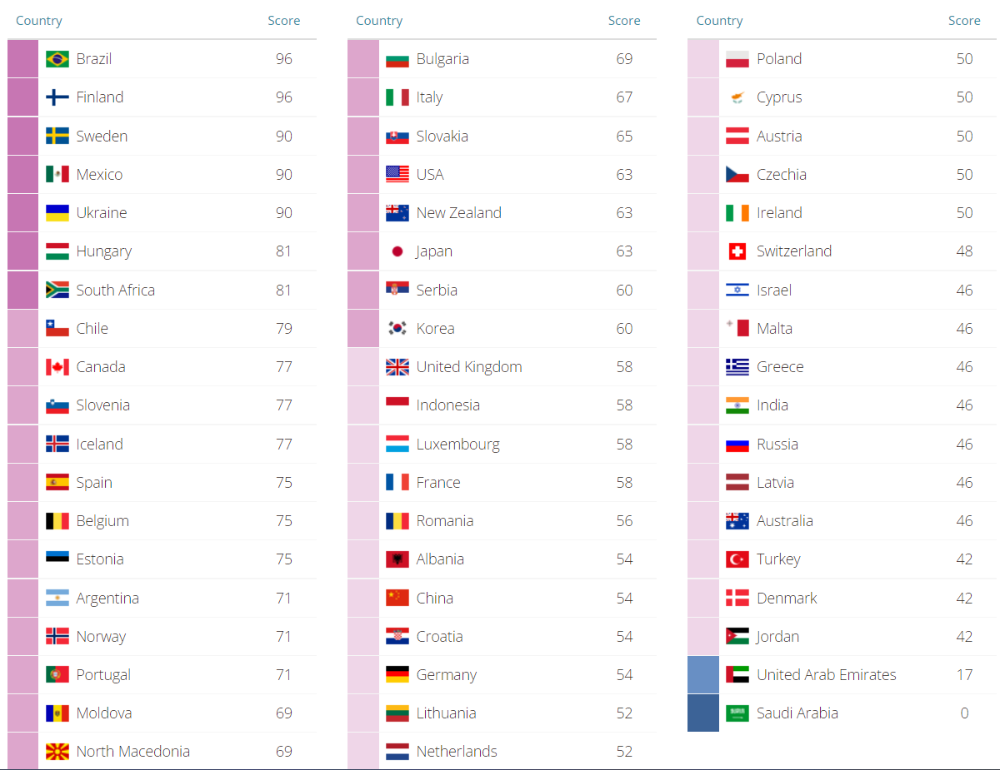
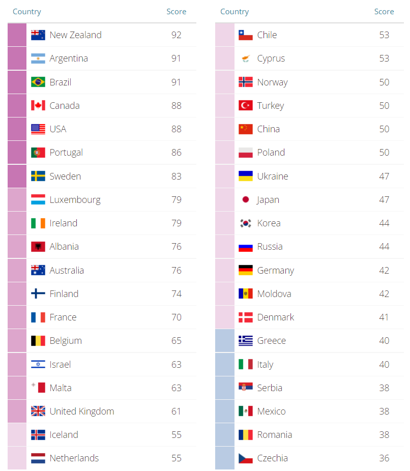

### مقدمه
یکی از پرتکرارترین دیالوگ‌هایی که چند وقت اخیر شنیدم:
- حاجی کانادا خیلی بهتر اروپاست. اروپا عملا روستاس. 
- عوضش اروپا نزدیکه. اگر خواستی می‌تونی سریع برگردی ایران. 
- اصلا بازار کار آمریکا قابل مقایسه با اروپا نیست. بعدشم آمریکا کشور آرزوهاس. American Dream رو نشنیدی؟ 
- تو دوران دکترا که همچین American Dream ای هم نیست. پولی که برای دکترا میدن خیلی کمه. 

قصد دارم نظرات خودم رو در چند مطلب مجزا راجع به این مباحث بنویسم. مخاطب در همه این پست‌ها یک فرد عادیه که هیچ آشنایی‌ای با مهاجرت نداره. دقیقا انگار دارم با چند سال پیش خودم صحبت می‌کنم. 

برای این که بحث چهارچوب بهتری داشته باشه، یک سری معیار رایج رو روی کشورهای مختلف بررسی می‌کنم. نهایتا این شما هستید که تصمیم بگیرید کدوم **معیارها** براتون وزن بیشتری داره و کدوم‌ها رو حاضرید فدا کنید. 

در اینجا روی دو کلمه «مهاجر» و «ایرانی» تاکید دارم. روی «مهاجر» تاکید دارم چون شرایط و قوانین کشور با توجه به این که مهاجر یا شهروند باشید، براتون تفاوت خواهد داشت. روی «ایرانی بودن» تاکید دارم چون معیاری مثل فاصله از کشور مقصد و وجود سفارت در داخل کشور صرفا در ایران معنی‌دار هست. 

در این پست صرفا معیارهایی رو میگم که برای یک «مهاجر ایرانی» مهم‌ هستند. معیارهای مهم برای مقایسه کشورها از نظر یک «شهروند» رو در پست بعدی میگم. 

## معیارهای مقایسه
بعد از مدتی گشت و گذار در اینترنت، این سایت رو پیدا کردم که خیلی خوب کشورهای مختلف از نظر یک مهاجر خارجی (نه لزوما ایرانی) بررسی کرده و کشورهای مشابه به ده دسته تقسیم‌بندی شده‌اند. ([+](https://www.mipex.eu/key-findings)). در جاهای مختلف این پست جهت مقایسه به این معیار MIPEX (Migrant Integration Policy Index) ارجاع خواهم داد. 

خب بریم سراغ معیارهایی که از نظر یه «مهاجر ایرانی» می‌تونه مهم باشه: 

### ۱- اقامت دائم (Permanent Residency)
سوالات مهم:
- بصورت میانگین چه مدت طول می‌کشه تا کشور به من، اقامت دائم بده؟ 
- آیا زمان تحصیل (در دوره دکتری) جزو زمان اقامت حساب میشه یا نه؟

همونطور که می‌دونید اجازه اقامت در یک کشور بصورت موقت و دائمی هست. اجازه حضور موقت در کشور به «ویزا» تعبیر میشه. ما معمولا با ویزای کاری یا تحصیلی وارد یه کشور می‌شیم و بعد از اتمام درس یا کار بعد از مدتی محدود (معمولا شش ماه تا یک سال) باید کشور رو ترک کنیم مگر اینکه دوباره ویزا بگیریم. اینجاست که بحث اقامت دائم یا اقامت (یا PR) اهمیت پیدا می‌کنه. کسی که اقامت دائم داره، می‌تونه تو کشور ول بچرخه و کسی دیگه بیرونش نمی‌کنه. البته ممکنه با خروج‌ از کشور به مدت طولانی اقامت‌تون باطل بشه. 

این یادداشت رو اقای امین شهرکی در لینکداین‌شون گذاشتند: 

> حالا به عنوان یک ایرانی شما حتما به فکر اقامت دایم و پاسپورت افتادین و باید بدونین کشورها تو این زمینه به سه دسته تقسیم میشن:
> 
>۱- کشورهای پولی مثل دومینیکن و ترکیه که یه پولی سرمایه گذاری میکنی و گاهی چند روزه پاسپورت‌شون رو میگیری. البته این پول انقدر واسه یه ایرانی الان بزرگ شده که تقریبا غیر ممکنه.
>
>۲- کشورهای امتیازی که شما برا گرفتن اقامت دائم‌شون می‌تونین با بدست آوردن یک سری امتیاز حتی بدون اینکه تو اون کشور حضور داشته باشید، اقدام کنین مثل کانادا، امریکا، استرالیا و نیوزیلند.
>
>۳- کشورهای زمانی که شما باید یک زمان خاصی رو توی اون کشور زندگی کنید و مالیات پرداخت کنین تا بتونین اقامت دائم بگیرید. بیشتر کشورهای اروپایی این‌طوری هستند.
>

مشخصا آلمان و هلند با پنج سال کار اقامت میدن ولی تو کشوری مثل سوئیس یا دانمارک این مدت تقریبا ده سال هست. در مورد کشورهایی که براتون سواله سرچ کنید «how many years to get pr in country_name» یا «requirements to get pr in country_name» و سلطان گوگل بهتون اطلاعات خوبی میده. 

کشورهای امتیازی مثل کانادا و آمریکا هم معمولا می‌تونید یه تخمین داشته باشید که با توجه به **شرایط شما** چقدر طول خواهد کشید که بهتون ویزا بدند. مثلا اگر بخواید کار کنید، تو کانادا بعد از ۲ ۳ سال کار معمولا امتیاز مناسبی می‌گیرید. توی آمریکا هم میشه بعد ۲ ۳ سال کار در ریسرچ (با بدست آوردن citation) برای NIW اقدام کرد و گرین کارت (همون اقامت دائم) دریافت کرد. ([+](https://www.chaolaw.com/niw-citations.html) و [+](https://www.uscis.gov/green-card)).

یک سوال مهم دیگه‌ای که برای بچه‌هایی که بصورت تحصیلی به **کشورهای امتیازی** میرن اهمیت پیدا می‌کنه اینه که آیا کشور، مدت زمان تحصیل رو جزو مدتی که باید در کشور باشید تا اقامت دائم بگیرید، به حساب میاره یا نه؟ مثلا تو هلند، چهار سال دکترا، جزو این زمان حساب میشه و بعد از پنج سال  (۴ سال دکترا +‌ ۱ سال کار) میشه، درخواست اقامت دائم داد. 

طبق یه قاعده کلی اون‌هایی که تو دوره دکترا حقوق میدن، مدت زمان تحصیل رو هم مثل کار حساب می‌کنند ولی اونهایی که بورسیه میدن نه. به نوعی براشون مهمه که مالیات ماهیانه پرداخت کنید. البته این تفاوت‌ها فقط برای دکترا صادق هست. من ندیدم جایی کارشناسی (‌‌Bachelor) یا مستر (Master) رو کار حساب کنند و معمولا جزو اقامت حساب نمیشه. 

در اینجا هم لینکی برای مقایسه کشورهای مختلف از نظر PR قرار میدم. این نمودار خیلی information زیادی نمیده. فقط در همین حد که کشورهایی که تو ستون سوم هستند، از نظر این معیار ضعیفن. علت این که این وب‌سایت رو اینجا قرار میدم اینه که کشوری که می‌خواید برید رو داخل وب‌سایت بزنید و دلایلی که امتیاز کم یا زیاد گرفته رو ببینید. 

- [Permanent Residence | MIPEX 2020](https://www.mipex.eu/permanent-residence)
- [مقایسه کشورها | گروه روت](https://rootgp.com/%d8%b1%d8%a7%d9%87%d9%86%d9%85%d8%a7%db%8c-%da%a9%d8%b4%d9%88%d8%b1%d9%87%d8%a7/%d9%85%d9%82%d8%a7%db%8c%d8%b3%d9%87-%da%a9%d8%b4%d9%88%d8%b1%d9%87%d8%a7/#1)

### ۲- شهروندی (Citizenship - Naturalization)
معمولا اخذ شهروندی بعد از اخذ اقامت دائم هست و گرفتنش راحت‌تره. با اخذ شهروندی - تابعیت - شما قانونا مثل بقیه افراد عادی اون کشور می‌شید مثلا می‌تونید رای بدید. مهم‌تر از اون پاسپورت می‌گیرید و می‌تونید با اعتبار اون پاسپورت رفت و آمد کنید. 

از طرفی شهروندی (بر خلاف اقامت) با خروج از کشور باطل نمی‌شه و می‌تونید به مدتی که می‌خواید برید و بیاید. فقط بعضی کشورها (مثل سنگاپور)، شرط می‌ذارند که اگر بخواید شهروندی اونا رو بگیرید، باید شهروندی ایران‌تون رو ابطال کنید. (در واقع Dual Citizenship رو قبول ندارند). با ابطال شهروندی ایران، دچار مشکلاتی از قبیل عدم اجازه مالکیت و حساب و ارث و اینها میشید.

به فرآیند تبدیل یه آدم عادی به شهروند، Naturalization یا بومی‌سازی گفته میشه. اگر همین کلید واژه رو در کنار اسم کشور سرچ کنید می‌تونید راجع به شهروندی اون کشور اطلاعات بدست بیارید چون اینطور مسائل کشور به کشور فرق داره. حتی ممکنه یه کشوری جدول امتیازات داشته باشه و اینطوری نیست که فقط یک زمانی لازم باشه تا بتونید شهروندی رو بگیرید ولی اگر بخوایم معیار در بیاریم مجبوریم قدری ساده‌سازی کنیم و حداقل مدت اقامت در کشور تا درخواست شهروندی رو یک معیار در نظر بگیریم. این عدد برای کشوری مثل هلند یا آلمان،  تقریبا پنج سال هست. 

شهروند اتحادیه اروپا رو با EU Citizen می‌شناسند. یک فایده‌اش اینه که ویزای شینگن می‌گیرید و می‌تونید بدون منتظر شدن برای ویزا تو اکثر کشورهای اروپایی سفر کنید. 

[این سایت](https://reachimmigration.com/en/passport-index/cards) معیاری برای نشون دادن ارزش پاسپورت کشورهای مختلف تعریف کرده و رنک بندی کرده. همچنین  در [اینجا ](https://www.mipex.eu/access-nationality)به کشورها از نظر آسونی اخذ شهروندی امتیاز داده. ولی من همچنان ترجیح میدم برای اقامت و شهروندی همون معیار سال رو در نظر بگیرم چون امتیاز صرف بهم دید خاصی نمیده. 

{{
}}
این مطلب به اصل بحث من ارتباط مستقیم نداره برای همین در پرانتر می‌نویسم. 

اصل خون و اصل خاک دو تا روش مختلف برای دادن شهروندی به فرزند هستند. کشورهایی که از اصل خاک پیروی می‌کنند، میگن وقتی فرزندتون تو خاک ما به دنیا بیاد، شهروند حسابش می‌کنیم. اصل خون میگه: «مهم نیست کجا به دنیا بیاد، همین که خون شهروند ما در رگش باشه، بهش شهروندی میدیم». مثلا ایران از اصل خون تبعیت می‌کنه. هر جای دنیا بچه بیارید بازم به راحتی پاسپورت ایرانی می‌گیره و ایرانی حساب میشه. اکثر کشورهای اروپایی هم از اصل خون تبعیت می‌کنند. 

کانادا و آمریکا از اون طرف اصل خاک رو قبول دارند. علت این که خیلی از بازیگرها میرن بچه‌هاشون رو تو کانادا و آمریکا به دنیا میارند هم همینه. از این نظر برای ما ایرانی‌ها، کشورهایی که اصل خاک رو قبول دارند، جذاب‌تر هستند. بالاخره گرفتن شهروندی به طور میانگین پنج، شش سال طول می‌کشه و اگر تو این مدت فرزند بیارید، فرزندتون شهروند حساب نمیشه. 

اینطور که من فهمیدم نهایتا هر کشوری خودش می‌گه که برای بچه‌هایی که شهروند نیستند، چیکار باید بکنند و مثلا بعد ۱۸ سالگی دیگه تقریبا همشون با یه شرایطی شهروندی رو میدن ولی خب گرفتن شهروندی بصورت درجا مزیت خیلی خوبی هست. 

[اصل خون - ویکی‌پدیا، دانشنامهٔ آزاد](https://fa.wikipedia.org/wiki/%D8%A7%D8%B5%D9%84_%D8%AE%D9%88%D9%86)
[اصل خاک - ویکی‌پدیا، دانشنامهٔ آزاد](https://fa.wikipedia.org/wiki/%D8%A7%D8%B5%D9%84_%D8%AE%D8%A7%DA%A9)

تو تصویر پایین کشورهای آبی‌پررنگ اصل خاک رو قبول دارند.



### ۳- مهاجر‌پذیری

با این که شعار تقریبا همه کشورها اینه که «ما از تنوع استقبال می‌کنیم و نژاد، جنسیت و دین اصلا هیچ‌ تاثیری نداره» ولی این که تا چه حد به این حرف عمل می‌کنند در هر کشوری فرق داره. اینجا می‌خوایم بسنجیم در هر کشوری چقدر **شهروند درجه دو** هستیم.

اگر بخوایم برای میزان مهاجرپذیری معیار در بیاریم که ملموس‌تر بشه، اولین معیار «تعداد افراد مهاجر» خواهد بود که تو تصویر زیر کشورهای با بیشترین مهاجر (Immigrant) مشخص هستند. 

فقط دقت کنید که «Emmigrant» با «Immigrant» فرق داره ولی تو دیکشنری هر دو مهاجر ترجمه می‌شن. فرض کنید من از ایران به کانادا رفتم. از لحاظ ایران من از کشور خارج شدم و تو آمار ایران Emmigrant حساب میشم. از نظر کانادا به کشورشون وارد شدم و Immigrant حساب میشم. تو این معیار هم Immigrant هر کشوری مهمه. 

- [Immigration by Country 2023](https://worldpopulationreview.com/country-rankings/immigration-by-country)
- [Countries with the Highest (and Lowest) Proportion of Immigrants](https://www.visualcapitalist.com/countries-with-the-highest-proportion-of-immigrants/)
- [10 Most popular countries for Immigration - Best Citizenships](https://best-citizenships.com/2021/09/29/10-most-popular-countries-for-immigration/)

به جز «تعداد مهاجرین»، بسیاری سایت معیارهایی برای «تبعیض نژادی» و «برابری نژادی» تعریف کردند. مثلا سایت MIPEX معیار به نام «anti-discrimination» تعریف کرده که هر چه بالاتر باشد بهتر است. 

سایت‌های دیگر هم کار مشابهی رو انجام دادند ولی من کلام کوتاه می‌کنم و صرفا لینک‌شون رو میارم که اگر دوست داشتید استفاده کنید:
-  [Anti-discrimination | MIPEX 2020](https://www.mipex.eu/anti-discrimination)
- [Best Countries for Racial Equality | U.S. News](https://www.usnews.com/news/best-countries/best-countries-for-racial-equality)
- [Racial Discrimination Survey - Table - IndexMundi Surveys](https://www.indexmundi.com/surveys/results/8/table)
- [Labour Market Mobility | MIPEX 2020](https://www.mipex.eu/labour-market-mobility)

با کنار هم قرار دادن معیارهای گفته شده تخمین بهتری از وضعیت مهاجرپذیری کشورها بدست خواهید آورد. 

> با یکی از اساتید صحبت می‌کردم می‌گفت، اگر بتونیم بسنجیم که یک مهاجر چقدر در بازار کار رشد می‌کنه و می‌تونه بالا بره معیار خوبی می‌تونه باشه. بعدا دیدم بله معیاری به نام Labor Market Mobility داریم که این رو اندازه‌گیری می‌کنه ([+](https://www.mipex.eu/labour-market-mobility))

### ۴- نزدیکی فرهنگی
تو بعضی فرهنگ‌ها ساده‌تر میشه دوست پیدا کرد. ساده‌تر میشه با مردم عادی تو کوچه خیابون گرم گرفت. مردم با هم راحت‌ترن. از طرفی مردم بعضی فرهنگ‌ها سردن. خشکن. دوست شدن باهاشون انقدر ساده نیست. 

مثلا سخت‌ میشه با یه آلمانی دوست صمیمی شد. اصلا ویدئوهای یوتیوب‌شون رو ببینید، طرف انگار انقدر انرژی نداره. از طرفی کشوری مثل مکزیک، مردم انگار با هم راحت‌ترند. فرهنگ ایران هم به نسبت گرمه. مهمون نواز هستیم. فامیل و دوست و آشنا برامون مهمه. من خودم وقتی میرم نانوایی نون بخرم، معمولا با یکی گرم صحبت میشیم و در مورد هر چیزی حرف می‌زنیم. مطمئن نیستم همچین کاری تو سوئد قابل انجام باشه!
 
در نگاه اول به نظر میاد این عامل با میزان مهاجرپذیری یکی باشه ولی من اینطور تعریف نمی‌کنم. من مهاجرپذیری رو بیشتر منعطف به قوانین کشور می‌دونم. این که چه امکاناتی به مهاجر میدن و تا چه اندازه بصورت قانونی، بهش حق و حقوق میدن. اینها قابل سنجش هستند اما نزدیکی فرهنگی چیزی نیست که بشه اندازه گرفت (یا حداقل من بلد نیستم).

فکر می‌کنم یه مسئله که به شدت با «گرم بودن و معاشرتی بودن» مردم ارتباط داره. انگار تو آب و هوای گرم مردم گرم ترند! داخل ایران هم میشه دید. مثلا اهوازی‌ها مردم خیلی مهمون‌نواز و اجتماعی‌ای هستند یا مثلا مکزیکی‌ها به نظر آدم‌های اجتماعی‌تری میان. از طرفی سوئدی‌ها نسبتا سرد ترن.

از یه جنبه هم میشه این مسئله رو فهمید. وقتی هوا سرده و برف جلوی خونه رو گرفته اصلا نمیشه از خونه بیرون رفت. با کی می‌خواید معاشرت کنید اصلا؟ وقتی ارتباط مردم با هم کم میشه انگار روابط اجتماعی تضعیف میشه. نهایت کاری که تو سرما میشه انجام داد اینه که بشینید خونه کتاب ببینید و فیلم بخونید یا دوستانتون رو دعوت کنید ولی قطعا نمیشه رفت پارک، جوجه درست کرد. 

اینجا فقط به سایتش اشاره می‌کنم و تو قسمت بعد بخش آب و هوا بیشتر توضیح میدم. 

[The Weather Year Round Anywhere on Earth - Weather Spark](https://weatherspark.com/)

### ۵- هزینه مسافرت به ایران
هزینه مسافرت به ایران دو بخش داره: هزینه رفتن به فرودگاه + هزینه پرواز

تو کشورهای اروپایی هزینه رفتن به فرودگاه ناچیزه ولی تو جایی مثل کانادا بسته به شهری که داخلش هستید این هزینه ممکنه خیلی زیاد بشه. حتی ممکنه این هزینه از هزینه پرواز بیشتر بشه.

مشخصا هر چی هزینه بیشتر باشه کمتر می‌تونید به ایران سر بزنید. 

اطلاعاتی که میگم رو از سایت [Search Flights, Hotels & Rental Cars | KAYAK](https://www.kayak.com/) استخراج کردم و مبلغ رو بر اساس دلار آمریکا (USD) گزارش می‌کنم. مبدا همه پروازها رو «فرودگاه امام‌خمینی تهران» (IKA) می‌زنم و مقصد رو متفاوت می‌زنم. در ضمن مبلغ‌هایی که نوشتم برای یک پرواز رفت هست (نه رفت و برگشت).

|      مقصد       |    ‌ رنج مبلغ     |
|:---------------:|:-----------------:|
| فرانکفورت آلمان |  ۵۰۰ تا ۷۰۰ دلار  |
|   بیسل سوئیس    |  ۴۰۰ تا ۷۰۰ دلار  |
|  آمستردام هلند  |  ۵۰۰ تا ۷۰۰ دلار  |
|  تورنتو کانادا  | ۱۱۰۰ تا ۱۵۰۰ دلار |
|   کبک کانادا    | ۱۴۰۰ تا ۱۷۰۰ دلار |
| نیویورک آمریکا  | ۹۰۰ تا ۱۱۰۰ دلار  |
|  میامی آمریکا   | ۱۴۰۰ تا ۲۲۰۰ دلار |
| سیدنی استرالیا  | ۲۴۰۰ تا ۳۱۰۰ دلار |
|                 |                   |

عکسی از قیمت پروازها از مبدا ایران در طول یک بازه تقریبا سه ماه (عکس رو می‌تونید از سایت www.kayak.com دقیق‌تر ببینید):

با کنار هم قراردادن این داده‌ها میشه گفت بلیط اروپا به طرز قابل توجهی از کانادا و آمریکا ارزون‌تره و همه اینها از استرالیا ارزون‌ترند. 

واقعا دیدن خانواده برای اونی که میره استرالیا مسئله بزرگی باید باشه چون رفت و برگشت یه نفر چیزی حدود ۵، ۶ هزار دلار آمریکا هزینه برمیداره و اگر زوج باشند ۱۱، ۱۲ هزار دلار میشه. 

برای آمریکا و کانادا باید بپذیرید که وقتی برید تا مدت‌ها نمی‌تونید پیش خانواده‌تون برگردید. فکر می‌کنم میشه گفت کسی که میره آمریکا باید به نسبت وابستگی خانوادگی کمتری داشته باشه. این تو شریف یه موضوع حل شده است و خیلی از بچه‌ها میگن «عوضش بعد تحصیل خیلی بیشتر پول درمیاریم» که خب البته درست میگن. بالاخره مثل همه تصمیم‌های زندگی یه trade-off عه که باید طرف‌تون رو مشخص کنید. بستگی داره یکی پول براش اهمیت بیشتری داره و یکی دیدن زود به زود خانواده براش مهم‌تره. در مقابل کشوری مثل هلند اینطوری هست که می‌تونید تقریبا سالی یک بار به خانواده سر بزنید.

> مثلا یکی از اساتیدمون که آمریکا رفته بود، می‌گفت که «هنگام فوت پدر و مادرش نتونسته به ایران برگرده و خب براش قابل قبول بوده». این موضوع ممکنه برای یه نفر دیگه به اندازه‌ای مهم باشه که قید تحصیل و کار و همه‌چی رو بزنه، فقط برای این که بتونه خاکسپاری رو شرکت کنه. 

یک موضوع دیگه هم ساعت پرواز هست که برای هر کشوری متفاوته ولی با توجه به این که اکثر پروازهای ما تو ایران مستقیم نیست و باید به قطر یا ترکیه بریم و از اونجا پرواز دوم سوار بشیم، این عامل رو بررسی نمی‌کنم (خودتون بررسی کنید).

> خیلی از این پروازها رو میشه لحظه آخر یا با تخفیف‌های دانشجویی خرید ولی به نظرم تو تصمیم‌گیری بهتره همیشه میانگین یا میانه رو مدنظرمون قرار بدیم. کلا تو آمار این دو تا معیار رو بیشتر از هر معیار دیگه‌ای دوست دارم. مخصوصا به نظرم میانه همواره نمایانگر بهتری از جمعیت هست چون میانگین خیلی متاثر از داده‌های پرت تو جمعیت میشه ولی میانه نه. مثلا درآمد بیل گیتس یا ایلان ماسک، میانگین درآمد آمریکایی‌ها رو به طرز قابل توجهی افزایش میده ولی روی میانه هیچ تاثیری نداره. نباید هم داشته باشه چون عملا داده پرت محسوب میشه. 

### ۶- ویزای الحاق (Family Reunification visa)
تقریبا همه کشورها شرایطی رو در نظر می‌گیرند که افراد خانواده بتونند دوباره در کنار هم جمع بشن به این فرآیند اصطلاحا Family Reunification میگن. به این نوع ویزا، ویزای همراه یا ویزای پیوست (به خانواده) - Dependent via - هم میگن. 

 سوالات مهمی اینجا وجود داره: 
- آیا ویزای همراه همزمان هست؟ 
- اجازه کار به همراه داده میشه یا نه؟
- چقدر طول می‌کشه تا ویزای همراه صادر بشه؟
- آیا لزوما دو نفر باید ازدواج کرده باشند؟ 

مشکل ویزای همزمان وقتی پیش میاد که شرطی در Requirement های ویزای وجود داره که تا به کشور مدنظر نرید نمی‌تونید اعمالش کنید. مثلا آلمان میگه که باید آدرس خونه پارتنر رو در ویزا بذارید. خب اینطوری ویزای همراه کنسل میشه. از طرفی این قوانین چند وقت یه بار عوض میشه و حتما خودتون مجدد چک کنید. مثلا آلمان زمان کرونا این شرط (و شرط مدرک آلمانی برای همراه) رو برداشته بود. 

اجازه کار یا Work Permit هم مهم‌ترین مسئله‌ای هست که باعث شد آمریکا از گزینه‌های من حذف بشه. ویزای تحصیلی در آمریکا F1 هست و ویزای همراه کسی که تحصیل می‌کنه با F2 شناخته میشه. با ویزای F2 اجازه کار داده نمیشه! اینه که معمولا وقتی دو نفر می‌خوان برن، نمیشه فقط یکی درس بخونه. هر دو درس می‌خونند ([+](https://www.novacredit.com/resources/f2-visa)).

معمولا تو کشورهای اروپایی با ویزای همراه (چه کاری باشه چه تحصیلی)، میشه کار کرد به شرطی که برای PhD برید. علتش هم اینه که دکترا در خیلی کشورهای اروپایی، شغل حساب می‌شه و شما عملا کارمند دانشگاه هستید و Salary می‌گیرید (نه Scholarship و نه Grant). البته کارشناسی (bachelor) و ارشد (master) جایی شغل حساب نمیشن و به این دلیل بعید می‌دونم همراه مجوز کار داشته باشه. این مورد رو در قسمت سوم بیشتر توضیح میدم. 

راجع به این که چقدر طول می‌کشه ویزای همراه صادر بشه، تنها راهی که من بلدم اینه که تو گروه‌های اپلای نگاه کنید ببینید اوضاع فعلا چطوریه. مشخصا کشورهایی که ایرانی‌ها بیشتر متقاضی‌شون هستند (مثل کانادا، آمریکا و المان) صف سفارت کلا طولانی‌تر خواهد بود از جایی مثل بلژیک. 

برای مقایسه کلی هم سایت MIPEX معیاری برای Family Reunion معرفی کرده و راجع به هر کشور اطلاعات خوبی داده. 

[Family Reunion | MIPEX 2020](https://www.mipex.eu/family-reunion)

پیشنهاد جستجو: requirements for family reunification visa for country_name

### ۷- مسائل ویزا و سفارت
سوالات مهم:
- چقدر وقت طول می‌کشه تا ویزا بیاد؟
- آیا سفارت کشور مد نظر داخل ایران هست؟
- صف سفارت چقدر طولانیه؟ چند ماه باید منتظر بمونم تا وقت سفارت بگیرم؟
- ویزای من Multiple هست یا Single ؟
- برای ویزایی که می‌گیرم اجازه کار هست؟

پروسه اخذ ویزا برای کشورهای اروپایی معمولا خیلی راحت‌تره. برای ما ایرانی‌ها معمولا ویزای آمریکا، «در جا» نمیاد. معمولا وارد روالی به نام Clearance میشید که میانگین ۹۰ روز طول می‌کشه تا بررسی بشید که مشکل خاصی (از نظر امنیتی) ندارید. بعد از اون ویزاتون صادر میشه. 

ویزا بر دو نوع هست: Single-Entry و Multiple-Entry. ویزای سینگل مجوز یک بار ورود به کشور رو صادر می‌کنه و اگر به ایران برگردید، دوباره باید وارد پروسه دریافت ویزا بشید. ویزای مالتیپل اجازه چند بار ورود رو صادر می‌کنه. مخصوصا برای من مهمه که اگر مشکلی برای خانواده‌ام پیش اومد توانایی برگشتن پیش خانواده رو داشته باشم. 

من تا به حال راجع به کشور جز آمریکا نشنیدم که این مورد برای ما ایرانی‌ها مسئله‌ساز باشه. مثلا اگر کانادا یا هلند برید می‌تونید تو طول مدت تحصیل‌تون برید به خانواده سر بزنید و بیاید ولی تو آمریکا اکثر ویزاهای ما ایرانی‌ها سینگل صادر میشه. یه بار تو یه ویدئو از دکتر تفاق می‌دیدم که می‌گفت بعد پذیرش MIT دلش خواسته برگرده ایران و برگشته. بعد دوباره سر فرآیند ویزا دادن کلی اذیت شده و یه ترم هم مرخصی گرفته تا بتونه دوباره به دانشگاه برگرده. 

دو تا از پرطرفدارترین کشورهای ایرانی‌ها، آمریکا و کانادا هستند که داخل ایران سفارت ندارند پس دردسر مهاجرت به این دو تا کشور از این نظر قدری بیشتره و خب باید موضوع رو پذیرفت. برای کسی که مشکل سربازی نداره، این مورد صرفا منجر به دادن پول و وقت بیشتر میشه چون باید به یه کشور دیگه (معمولا ترکیه، دبی یا پاکستان) بره و از سفارت اونجا درخواست بده ولی برای کسی که سربازی داره خیلی مشکل‌تره.

برام عجیبه که برای کانادا این مورد دو طرفه هست یعنی داخل کانادا هم سفارت ایران نداریم. اگر کار خاصی داشته باشید باید مثلا برید سفارت ایران در آمریکا (!) و کارتون رو انجام بدید. 

یه مشکل رایج دیگه که آمریکا خیلی بیشتر از بقیه جاها داره اینه که ممکنه ویزا صادر نشه. معمولا علتی هم براش نمیارن. از دوستانم که رفتند معمولا کسی نگران ویزای اروپا یا کانادا نیست ولی در مورد آمریکا قدری نگرانی بیشتره.

برای بقیه کشورها این مورد تقریبا وجود نداره. اکثر کشورهای اروپا (حتی انگلیس) تو ایران سفارت دارند و می‌تونید کارهای سفارتی و اخذ ویزا و امثالهم رو از داخل تهران پیگیری کنید. 

یک موضوع دیگه هم که باید در نظر بگیریم وقت (صف) سفارت هست. این مورد برای کانادا آمریکا معمولا خیلی طولانی‌تر از اروپا هست. مثلا برای آمریکا تقریبا باید شش تا نه ماه تو صف باشید و این عدد برای اروپا چیزی در حد چند ماه هست. 

[فهرست وابسته‌های دیپلماتیک در ایران - ویکی‌پدیا، دانشنامهٔ آزاد](https://fa.wikipedia.org/wiki/%D9%81%D9%87%D8%B1%D8%B3%D8%AA_%D9%88%D8%A7%D8%A8%D8%B3%D8%AA%D9%87%E2%80%8C%D9%87%D8%A7%DB%8C_%D8%AF%DB%8C%D9%BE%D9%84%D9%85%D8%A7%D8%AA%DB%8C%DA%A9_%D8%AF%D8%B1_%D8%A7%DB%8C%D8%B1%D8%A7%D9%86)

### ۸- یادگیری زبان سوم (و شایدم چهارم)
در اهمیت یادگیری زبان سوم همین بس که هنگام گرفتن اقامت دائم یا شهروندی باید یک امتحان روی زبان رسمی اون کشور بدید. 

زبان رسمی کشورهایی مثل کانادا، آمریکا، استرالیا و انگلیس (!)، انگلیسی هست (استثنا، استان کبک در کانادا، زبان رسمی فرانسه رو داره).

ولی زبان رسمی اکثر کشورهای اروپایی، انگلیسی نیست. اینجاست که باید یک زبان سوم یاد بگیرید. احتمالا تو دانشگاه و صنعت با همون انگلیسی کارتون راه میافته ولی تو زندگی اجتماعی نه لزوما. مثلا بعضی مغازه‌دارها یا تاکسی‌‌ها در آلمان فقط آلمانی بلدن! 

راجع به زبان چهارم گفتم چون تو بعضی کشورها مثل سوئیس، زبان مردم هر منطقه‌ای می‌تونه متفاوت باشه. اینجاست که شاید مجبور بشید علاوه بر یادگیری زبان سوم، هنگام تعویض خونه، به یادگیری زبان چهارم فکر کنید. 

شاید اولش فکر کنید که این موضوع می‌تونه مزیت باشه ولی دید من نسبت به زبان کاملا ابزاری هست، ما زبان رو یاد می‌گیریم که با یکدیگر **ارتباط** برقرار کنیم. همین. یادگیری زبان به خودی خود ارزشمند نیست صرفا یه ابزار ارتباطیه. باید ازش استفاده کرد تا کار پیش بره. همون طور که تو بحث برنامه‌نویسی نمیگیم کسی که به تمام زبان‌های برنامه‌نویسی کد می‌زنه خفنه. اصلا کسی نیاز نداره همچین کاری رو بکنه. بسته به نیازش یک یا دو زبان رو یاد می‌گیره و با همون‌ها کارش رو برطرف می‌کنه.

تو همچین نگاهی یادگیری زبان یه مسئله حداقلی میشه. تو این حالت من خیلی راحت ترم تمام مکالماتم رو به زبان انگلیسی انجام بدم.

[List of countries by English-speaking population - Wikipedia](https://en.wikipedia.org/wiki/List_of_countries_by_English-speaking_population)

لیستی مثل لیست بالا نشون میده که هر کشور چقدر انگلیسی زبان داره و چقدر می‌تونید تو مکالمات روزمره از انگلیسی صحبت کنید. هر چند نهایتا زبان کشور مقصد رو باید یاد بگیرید. 

### ۹- بقیه معیارها
سایت MIPEX، کشورها رو از نظر معیارهای دیگه‌ هم بررسی کرده. مثلا در نظر گرفته که کشور چقدر به آموزش مهاجر بها میده؟ چقدر به سلامت مهاجرینش رسیدگی می‌کنه؟ 

در اینجا چون خودم به شخصه حرف خاصی ندارم صرفا به سایت ارجاع میدم که خودتون برید مطالعه کنید. تو قسمت Policies، هشت معیار گذاشته که از این نظر کشورها رو با هم مقایسه کرده. 

[MAIN FINDINGS | MIPEX 2020](https://www.mipex.eu/key-findings)

### معیارهای من
معیارهایی که به نظر من خیلی مهم هستند: 
- اقامت و شهروندی
- آب و هوا
- فاصله از ایران
- ویزای همراه (همزمان + اجازه کار)

## پی‌نوشت
پی‌نوشت اول: بعضی‌ها میگن اول به یه کشور دیگه میریم که صرفا از ایران رفته باشیم، بعد از مدتی از همونجا درخواست میدیم و به یه کشور دیگه میریم. مثلا من اوایل می‌خواستم برم دانشگاه EPFL سوئیس دکترا بخونم و بعد از چهار سال، دوباره به کانادا مهاجرت کنم تا اونجا بتونم کار پیدا کنم و اقامت و شهروندی بگیرم. این قضیه از نظر تئوری ممکنه ولی باید توجه کنید که این کار اصلا ساد‌ه نیست. 

تو هر کشوری کلی چیزها باید یاد بگیرید که خاص اون کشور هست. مثلا این که کجا برم خرید کنم. بیمه چطوریه. خونه چطوره. کجا مواد غذایی بخرم. لباس چی خوبه. خونه کجا خوبه. سوار شدن به مترو چطوریه. 

با مهاجرت مجدد، عملا تمام این اطلاعاتی که قبلا بدست آوردید به درد نخور میشن و این بسیار سخته. 

پی‌نوشت دوم: این رو باید بپذیریم که کشوری که از هر نظر کامل و پرفکت و مناسب شرایط ما باشه، وجود خارجی نداره. هر کشوری در کنار مزایاش یه سری معایب داره. یکی دوره، یکی آب و هواش بده، یکی وضع سلامتش جالب نیست، اون یکی دیر اقامت و شهروندی میده. 

پی‌نوشت سوم: من نه وکیل مهاجرتی‌ام. نه قانون بلدم. نه اصلا تخصص در این زمینه دارم. یک چیزهایی برای خودم مهم بوده که اینجا نوشتم. حتما راجع به تک‌تک این موارد جستجو کنید. هر کشور یه عالمه شرایط خاص داره که برای هر فرد خاص متفاوت میشه. من می‌خوام بگم که این معیارها وجود داره و باید بهش توجه بکنید. 

گوگل، دوست ماست. اگر راجع به هر کشور جستجو کنید می‌تونید به سادگی اطلاعات مهمی راجع به معیارهایی که گفتم بدست بیارید. اگر من می‌خواستم اطلاعات جامعی راجع به همه کشورها بدست بیارم سپس این مطلب رو بنویسم، شاید هیچ وقت نباید این مطلب رو منتشر می‌کردم. این رو منتشر کردم که باب گفتگو باز بشه و افراد دیگه‌ای هم بعدا من رو نقد کنند و الی اخر. 

## لینک‌های مفید
اقای امین شهرکی در مجموعه‌ای از پست‌های لینکداین راجع به بعضی نکات صحبت کردند و مستقیما بهشون ارجاع دادم. بد نیست کل متن‌شون رو هم بخونید. 

[https://www.linkedin.com/in/amin-shahraki/](https://www.linkedin.com/in/amin-shahraki/)

[گروه روت | انجمن مشاوره تخصصی با نخبگان](https://rootgp.com/)

- [Fastest and Easiest Country to Get Second Citizenship 2023](https://immigrantinvest.com/blog/easiest-way-to-get-citizenship-en/)
- [Easiest Countries to Immigrate To 2023](https://worldpopulationreview.com/country-rankings/easiest-countries-to-immigrate-to)
- [Fastest and Easiest Country to Get Second Citizenship 2023](https://immigrantinvest.com/blog/easiest-way-to-get-citizenship-en/)

این مطلب ادامه دارد ... 