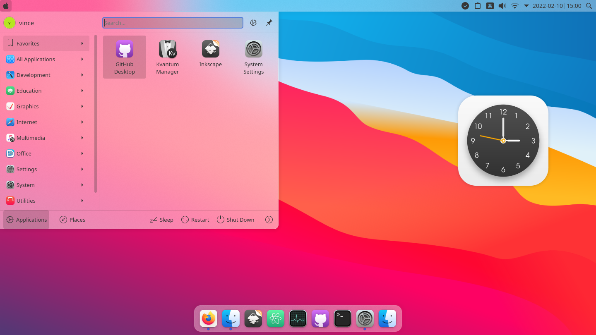

پست قبلیم که در مورد لینوکس گذاشتم ثقیل و سنگین بود. این پست رو سعی می‌کنم روان‌تر بنویسم. بریم ببینیم که چی پیش میاد. 

پست قبلی: [توزیع‌های مختلف لینوکس - ارائه یک دسته‌بندی | گاه‌نوشته‌های امیرپورمند](https://aprd.ir/linux-distributions-review/)

اولین آشنایی من با لینوکس در درس آزمایشگاه سیستم‌عامل بود. اون زمان با Ubuntu 18.04 کار می‌کردیم. راستش از اون زمان خیلی از دستکاپ اوبونتو (Gnome) خوشم نیومد. اصلا درک نمی‌کردم چرا کسی باید ویندوز رو ول کنه و با لینوکس کار کنه. 

به خاطر همین تجربه بد، تا سال‌ها کاری به کار لینوکس نداشتم و به خودم می‌گفتم اگر لینوکس اینی هست که من دیدم، صد سال سیاه می‌خوام استفاده نکنم. 

ولی وقتی به شریف اومدم دیدم که درصد قابل توجهی از بچه‌ها از لینوکس استفاده می‌کنند. این بود که دوباره ارزیابی‌اش کردم و خیلی چیزها از کارکردن با لینوکس یاد گرفتم. 

فکر می‌کنم آموزش دانشگاهی بعضی جاها حتی مضرتر از بی‌سوادی یا اطلاع نداشتن از موضوع هست! به نظر من، حداقل کاری که یک آموزش خوب باید انجام بده، اینه که دانشجو به موضوع **علاقه‌مند** بشه که بعدا بصورت شخصی پیگیری‌اش کنه و حتی شاید به عنوان شغل ادامه‌اش بده. 

ولی هر موضوعی رو اول از دانشگاه یاد گرفتم، ازش متنفر شدم! بعدا که خودم دنبالش کردم، دیدم که واقعا چه موضوع جالب و کاربردی‌ای هست. تو کارشناسی (مهندسی کامپیوتر) برای من همچین اتفاقی نیافتاد؛ چون قبلش تو صنعت کار می‌کردم و با کاربرد بسیاری از دروس آشنا شده بودم. سر کلاس هم فقط لذت می‌بردم (در واقع در کل دوره کارشناسی یک کلمه هم جزوه ننوشتم. فقط می‌نشستم سرکلاس و با استاد بحث می‌کردم). انصافاً از صحبت‌کردن با اساتید باسواد (نه همه اساتید) خیلی چیزها یاد گرفتم. 

اما مثلاً هوش مصنوعی رو اول از طریق دانشگاه باهاش آشنا شدم و ازش بدم اومد. بعدا که خودم مطالعه کردم دیدم چه جالبه. 

از غرزدن به آکادمیک که بگذریم، بحث لینوکس رو داشتم می‌گفتم. 

بهار ۱۴۰۰ بود که وسط ایام امتحانات پایان‌ترم گفتم: «لینوکس نصب کنم، ببینم دقیقا چی هست». قبلش بارها توزیع‌های مختلف لینوکس رو روی VMware یا VirtualBox تست کرده بودم. تا این که یکی از بچه‌ها بهم گفت که تا لینوکس رو مثل آدم روی سیستم‌ات نصب نکنی نمی‌فهمی یعنی چی. منم امتحان پردازش تصویر (Image Processing) داشتم و سه روز وقت داشت. گفتم وقت خوبیه :) 

منظور دوستم از مثل آدم نصب کردن این بود که لینوکس رو روی سخت‌افزار واقعی (یا Bare Metal) نصب کنم. راست هم می‌گفت. تجربه استفاده از لینوکسی که روی سیستم‌عامل مجازی داخل ویندوز بالا میاریم با لینوکس روی سخت‌افزار واقعی متفاوت هست. 

اولین سوالی که برای هر کسی پیش میاد اینه که خب حالا چی نصب کنم؟ اگر یوتیوب رو ببینید ویدئوهای بسیاری با این عنوان که چرا فلان توزیع از بیسار توزیع بهتر هست وجود داره ولی من نمی‌خوام همچین کاری رو انجام بدم.

من هم زمانی گرفتار همچین بازی‌ای شده بودم (بهش میگن Distro hopping). اون زمان همیشه سوال اصلی‌ام این بود که **چه عواملی وجه تمایز توزیع‌های مختلف لینوکس هست؟** ویدئوهای زیادی می‌دیدم ولی جواب سوالم رو پیدا نمی‌کردم. 

برای انتخاب توزیع نزدیک‌ترین چیز به Ubuntu که دستکاپ KDE Plasma رو داشته باشه انتخاب کردم (Kubuntu). به نظرم یکی از زیباترین و Customizableترین دستکاپ‌های موجود همین KDE Plasma هست. قطعاً Configuration‌های مختلفی که داره، می‌تونه روزها آدم رو درگیر کنه. 

برای من که قبلا داخل ویندوز محدود بودم. این تجربه جالبی بود که چقدر یک توزیع با نصب Theme می‌تونه تغییر کنه. ما نسبت به کلمه Theme بدبین شدیم؛ چون احتمالا اولین برخورد ما با این کلمه داخل اندروید یا ویندوز بوده که به تجربه دیدیم، تقریبا هیچ تفاوت ملموسی بوجود نمیاد و فقط وقت تلف کردنه. 

اینجا یکی از تم‌هایی که انصافا دوست داشتم، تم MacOS ‌Big Sur بود. این تم رو از KDE Store گرفته بودم و نصب کرده بودم. محیط دستکاپ KDE خیلی زیاد پلاگین داره و میشه به سادگی برای کاربردهای مختلف Customize اش کرد. 

در واقع اولین انتخاب تم برای من این نبود و کلاً هم از اکوسیستم مک خوشم نمی‌اومد اما کم کم (با نصب تعداد زیادی تم) دیدم که با این تم میشه خیلی بهینه از فضای بالای صفحه نمایش استفاده کرد؛ چون منوهای نرم‌افزارهای مختلف خیلی کوچک و جمع‌جور اون بالا قرار می‌گیرند. 

برای خودم خوشحال بودم و نرم‌افزارهای مختلف لینوکسی رو تست می‌کردم و اسکریپت نصب آماده درست می‌کردم. مثلا [این](https://github.com/pourmand1376/.dotfiles/blob/main/install/kubuntu_install.sh) اسکریپتی هست که برای نصب ابزارهای مورد نظرم در Kubuntu نوشته بودم. 

طولی نکشید که چند تا از نرم‌افزارهای مورد نیازم یک سری آپدیت دادند. اون زمان فکر کنم تلگرام تازه فونت فارسی اضافه کرده بود. چند ماه صبر کردم دیدم که نه! این آپدیت حالا حالاها برای توزیع‌های مبتنی بر Ubuntu نمیان. 

اینجا بود که کم‌کم به پکیج‌ منیجرهای دیگه هم فکر کردم. گفتم برم یک توزیعی داشته باشم که انقدر من رو معطل نگه نداره. نهایتا انتخاب من Manjaro بود و در اولین تجربه دستکاپ Budgie رو انتخاب کردم. 

ادامه دارد ... 