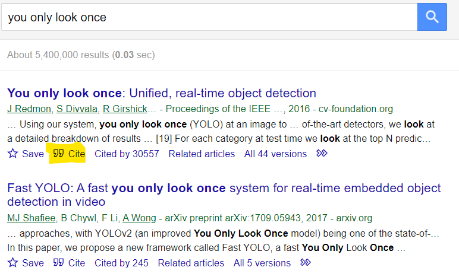

جامعه هدف این پست بیشتر بچه‌های ارشد (خصوصا شریفی‌ها) هستند. کلیت مطلب البته همه جا یکی است اما جزئیات احتمالا تو دانشگاه‌های دیگه تفاوت‌هایی داشته باشه. 

از معایب کشورمون اینه که کمتر چیزی داکیومنت میشه و هنوز به روش قدیمی انتقال سینه به سینه وفاداریم. این موضوع مخصوصا برای ما بچه‌های ورودی ۹۹ که مجازی بودیم کار رو خیلی سخت‌ کرد؛ چون اصلا کسی نبود که تجربیات رو ازش بپرسیم. محدودیت‌های تلگرام رو هم که خودتون بیشتر می‌دونید. کسی حوصله نداره زیاد تایپ کنه و ویس گرفتن هم داستان خودشو داره. من می‌نویسم. بقیه هم بنویسند تکمیل میشه. 

فقط این نکته رو در نظر بگیرید که حرف‌هایی که می‌زنم چیزی جز اظهارنظر شخصی و بیان تجربیات به شدت محدود من نیست. پس بهتره تعمیم به کل ندید و در مواردی که ممکنه بحث‌برانگیز باشه با مشورت با بقیه تصمیم بگیرید. 

تو دوره ارشد سه تا گزارش از روند کارمون باید ارائه بدیم که هر بار مفصل‌تر و جامع‌تر میشه. اول که وارد دانشگاه میشیم استاد راهنما انتخاب می‌کنیم. بعدا این طرف اون طرف ول می‌چرخیم (کورس پاس می‌کنیم) تا موضوع تز (پایان‌نامه) انتخاب کنیم. انتخاب رسمی موضوع تز با «پروپوزال» انجام میشه. بعدا در درس «سمینار» بیشتر در مورد موضوع تحقیق میشه و عملا فصل یک و دو پایان‌نامه نوشته میشه. پایان‌نامه هم که آخرین مرحله است. 

هر سه این گزارش‌ها باید به زبان «[فارسی مریض](https://mrshabanali.com/%D9%88%D8%A7%D9%82%D8%B9%DB%8C%D8%AA-%D8%AA%D9%84%D8%AE-%D8%B2%D8%A8%D8%A7%D9%86-%D9%81%D8%A7%D8%B1%D8%B3%DB%8C-%D8%AF%D8%B1-%D8%A8%D8%B3%D8%AA%D8%B1-%D8%A7%D8%AD%D8%AA%D8%B6%D8%A7%D8%B1-%D9%85%D8%B1/)» باشند یعنی اصطلاحاتی مثل «شبکه CNN» هم باید ترجمه بشن و به حالت غیرقابل‌فهم تبدیل بشن. منظورم از غیرقابل فهم اینه که هر کسی یه کم با ماشین لرنینگ آشنا باشه می‌دونه «Regression یا رگرسیون» چیه ولی تقریبا هیچ کس نمی‌دونه «وایازش» چیه و مجبوره برای فهم یه جمله بره داخل لغت‌نامه فارسی به انگلیسی و بگه «آهان. منظورش این بود». بعد برگرده بقیه جمله رو بخونه. ترجمه Adversarial Training به حملات هم‌آورد هم همچین چیزی هست! 

بگذریم. ولی ارائه سمینار و پایان‌نامه رو میشه انگلیسی اماده کرد. اصلا من ندیدم کسی اسلاید فارسی درست کنه. 

## پروپوزال
پروپوزال یه فایل در حد دو صفحه‌ است که کلیت کارتون رو مشخص می‌کنه. معمولا اواخر ترم دو پروپوزال رو باید نهایی کنید. کلا توضیحاتی که من در مورد پروژه ام ارائه دادم دو تا پاراگراف بود (حداکثر ۲۵۰ کلمه باید باشه).

پروپوزال ارشد جلسه نداره. ارائه نداره. نمره هم نداره. یه موضوعی رو با استادتون هماهنگ می‌کنید و میره تو جلسه گروه. معمولا هم تایید میشه. احتمالا دلیلش اینه که قبلا با استادتون سر موضوعی توافق کردید و وقتی استاد راهنما تایید کنه معمولا بقیه اساتید هم تایید می‌کنند. فقط نکته‌اش اینه که هر چی پروپوزال رو از ددلاینی که تعریف شده، دیرتر تحویل بدید از نمره سمینارتون کم میشه. فکر کنم هفته‌ای ۲۵ صدم کم میشه. در ضمن تو همون جلسه گروه (که بین اساتید تشکیل میشه)، داور داخلی شما مشخص میشه و بعد جلسه می‌تونید از استاد راهنماتون بپرسید.  

آسون‌ترین مورد نوشتن پروپوزال هست چون عملا دارید یه سری آمال و آرزو مطرح می‌کنید که ان‌شاءالله بهش برسید. 

تمپلت ورد پروپوزال رو هم [اینجا](M.ScProjectDefinitionForm.docx) گذاشتم. پروپوزال تمپلت لتک نداره یا حداقل من پیدا نکردم. 

به طور کلی فرم‌های دانشکده رو تو این دو تا لینک می‌تونید پیدا کنید. بصورت مرجع داشته باشید برای خیلی از کارهای اداری دیگه لازم میشه. 
- [فرم‌های دانشکده مهندسی کامپیوتر](https://docs.ce.sharif.edu/%D9%81%D8%B1%D9%85_%D9%87%D8%A7/%D9%81%D9%87%D8%B1%D8%B3%D8%AA)
- [فرم‌های دانشکده مهندسی کامپیوتر](http://edu.ce.sharif.edu/forms/cat/15/)
- [فهرست [دانشکده مهندسی کامپیوتر]](https://docs.ce.sharif.edu/)
- [تحصيلات تکميلی دانشگاه صنعتی شريف](https://grad.sharif.edu/fa/forms.asp)

ترجیحا تو[ این کانال](https://t.me/CESUTDocs) هم عضو بشید. یکی از بچه‌های دکترای شریف راه‌اندازیش کردند. بسیار مفیده.

## سمینار
برای توضیحات کلی در مورد سمینار ابتدا این مطلب رو بخونید. 
[نحوه ارائه سمینار - سمینار کارشناسی و کارشناسی ارشد - بیشتر از یک نفر](https://www.bishtarazyek.com/%D9%86%D8%AD%D9%88%D9%87-%D8%A7%D8%B1%D8%A7%D8%A6%D9%87-%D8%B3%D9%85%DB%8C%D9%86%D8%A7%D8%B1/)

سمینار یه درس دو واحدی هست که معمولا بچه‌ها ترم سه ارشد برمیدارند (البته میشه ترم چهار هم درسش رو برداشت). در این درس باید راجع به کاری که می‌خوان انجام بدن تحقیق بیشتری بکنند و دقیق‌تر مسیر رو مشخص کنند. عملا تو شریف اینطوریه که دانشجوی ارشد باید اواخر ترم دو، پروپوزالش رو بنویسه و تایید کنه و اواخر ترم سه باید سمینار ارائه بده. اواخر ترم چهار یا پنج یا شش هم دفاع کنه بره دنبال زندگیش.

نکته اول در مورد سمینار اینه که معمولا کلاس نداره. شاید نهایتا یه جلسه توجیهی براتون بگذارند و بهتون توضیح بدن که چه چیزهایی مورد انتظاره. اون هم معمولا برگزار نمیشه چون پیش‌فرض اینه که از دوستاتون می‌پرسید. 

سمینار به نظرم دو بخش اصلی داره: گزارش و ارائه. 
### ۱- گزارش سمینار
این گزارش شامل چکیده، مقدمه، اهمیت تحقیق، ادبیات تحقیق، مدل پیشنهادی‌ و زمان‌بندی پروژه و واژه نامه و مراجع هست . یه جدول هم باید بذارید که مشخص باشه طبق چه زمانبندی‌ای می‌خواید کار کنید. عملا بعدا می‌تونید همون مطالب سمینار رو کپی کنید برای فصل یک و دو پایان‌نامه داشته باشید. معمولا فایل گزارش سمینار رو قبلش به استاد راهنما (و Supervisor دکتراتون) می‌فرستید و یه سری کامنت می‌گیرید. 

فایل گزارش تو شریف، روی هم رفته (با احتساب مراجع و واژه‌نامه) نباید بیشتر از ۱۵ صفحه بشه و اتفاقا همه دقیقا ۱۵ صفحه می‌نویسند. 

حداقل یه هفته قبل باید فایل گزارش سمینار رو برای استاد راهنما، داور و رئیس جلسه (که جلوتر توضیح دادم) بفرستید. من به مدیرگروه هم فرستادم. 

مستحب موکد هست که یه اجرای اولیه گرفته باشید و نتایج در حد مقدماتی داشته باشید. آنالیز دقیق و پیشرفته نمی‌خواد ولی خب در حد یکی دو تا اجرای ساده رو انتظار دارند. مثلا یه کار عرف اینه که یه سری تحقیق‌های قبلی رو عینا اجرا کنید و بگید من دو تا کار قبلی رو اجرا کردم و فعلا این نتایج رو گرفتم. جالب نیست یه سری چیز تئوری رو بیاید بگید و برید. 

مدل پیشنهادی هم برای این لازمه که ببینند یه سری ایده دارید که می‌خواید کار رو جلو ببرید. ممکنه هیچ کدوم از ایده‌هاتون جواب نده (و احتمالا همینه). احتمالا براتون سوال پیش میاد که آیا بهبود نسبت به بقیه مدل‌ها هم باید داشته باشیم یا نه؟ به نظر من لازم نیست. بهبود برای تز ارشده. 

اگر بتونید همه کارهای قبلی رو تو یه جدول خلاصه کنید هم به درد گزارش می‌خوره هم ارائه. هر کار یه سری نقاط ضعف و نقاط قوت داره. قاعدتا نقاط قوت‌شون رو تو مقاله‌شون به رخ می‌کشند و مشخصه. شاید نقاط ضعف رو داخل Discussion یا Future Works بصورت ضمنی اشاره بکنند ولی معمولا انقدر مرد نیستند :)‌ زحمت بکشید تو گوگل سرچ کنید حتما نقد زیاد بهش وارد شده. جدیدا هم بعضی ژورنال‌های معروف، نظرات Reviewerها رو بصورت عمومی منتشر می‌کنند. می‌تونید از همون‌ها به عنوان معایب مقاله استفاده کنید. 

برای گزارش سمینار تمپلتی بین بچه‌های مختلف دست به دست میشد و حالت‌های مختلفی داشت. من این رو ویرایش کردم و فعلا با تک‌لایو ۲۰۱۶ الی ۲۰۱۹ کار می‌کنه. دقت کنید تو Overleaf ورژن اولیه تک‌لایو ۲۰۲۲ هست که با این تمپلت کار نمی‌کنه. کامپایلر رو هم حتما باید xelatex انتخاب کنید و pdflatex یا latex مناسب فارسی نیستند. 

[GitHub - pourmand1376/Seminar_Sharif: فرمت سمینار دانشگاه صنعتی شریف](https://github.com/pourmand1376/Seminar_Sharif)

نکته مهم این که کسی مجبورتون نکرده که با لتک بنویسید کما این که چند نفر از دوستان من هم سمینار و هم پایان‌نامه رو با ورد نوشتند و تحویل دادند ولی اگر می‌خواید کار تحقیقاتی بکنید به نظرم ورد انتخاب معقولی نیست که جلوتر دلایلم رو توضیح دادم. 

فایل گزارش سمینار با فرمت ورد هم [اینجا](Seminar-Template.docx) گذاشتم. 

در یکی از گروه‌ها یک فایل pdf برای سمینار ارسال شده بود که [اینجا](it-seminar-introduction-1401.pdf) قرار میدم. توضیحات خوبی داره. فکر می‌کنم نویسندگان فایل راضی بودند که این فایل پخش بشه چون در قالب ایمیل برای همه بچه‌ها فرستادند. در ضمن آقای کارگران [در اینجا ](https://github.com/kargaranamir/sharif-seminar-template/blob/main/rules.pdf)فایلی راجع به قوانین سمینار گذاشتند که دیدنش خالی از لطف نیست.  

برای شکل کشیدن هم بعضی‌ها از [draw.io](https://app.diagrams.net/) استفاده می‌کنند و بعضی‌ها هم از Powerpoint. به نظر من استفاده از [FigJam](https://www.figma.com/figjam/) معمولا خروجی خیلی قشنگ‌تری میده. این شرکت Figma زمانی رقیب سرسخت شرکت Adobe بود در زمینه دیزاین. تا این که Adobe کلا خریدش :) ولی هنوز هم محصولات خیلی خوبی داره فیگما و خیلی از UI Designerها از این استفاده می‌کنند. 

### نکات گزارش سمینار
- رفرنس‌ها حتما فرمت استاندارد باید داشته باشند. اگر از لتک استفاده می‌کنید که خود به خود استاندارد میشه. اگر از ورد استفاده می‌کنید حتما باید هنگام خروجی گرفتن از Google Scholar فرمت یکسان مثل MLA یا ... رو انتخاب کنید. 
- نیم‌فاصله و غلط املایی نداشته باشید. نمی‌خواد ۱۰ بار بخونید. مطلبی که نوشتید رو به [پاک‌نویس](https://paknevis.ir/) بدید براتون درست می‌کنه. قدیم من از ویراستیار استفاده می‌کردم که به درگاه حق تعالی شتافت. به نظرم جالب‌تر از پاک‌نویس بود.
- کپشن (caption) جدول باید بالاش نوشته بشه و کپشن شکل پایینش. این مورد خیلی برای اساتید مهمه و یه اشکال رایجی هست که از سمینار می‌گیرند. در ضمن تمام فرمول‌ها باید شماره‌گذاری بشن. 
- تمام اشکال و نمودارها (جز اون‌هایی که خودتون کشیدید) باید مرجع داشته باشند. 
- قبل از رفرنس‌هاتون فاصله بذارید! مثلا نگید سلام\[1] بگید سلام \[1].
- یک حساسیت بسیار زیاد (و به نظر من غیرمنطقی) وجود داره که لغات داخل سمینار و خصوصا پایان‌نامه حتما فارسی باشند. این که اساسا این کار چه کمکی می‌کند و چرا باید انجام شود، یک بحث است که جاش اینجا نیست. ولی دوستان یک ریپازیتوری درست کردند که بتونید خیلی ساده‌تر معادل کلمات انگلیسی رو پیدا کنید. این لغت‌نامه اکثرا شامل واژه‌های فیلد کامپیوتر هست. 

[GitHub - hkhojasteh/EN-FA-CS-Dictionary: An English-Persian Dictionary of Computer Science and Artificial Intelligence](https://github.com/hkhojasteh/EN-FA-CS-Dictionary)

- ترجیحا تمام افعال باید مجهول باشند! پس نباید بگید «ما فلان کار را کردیم» بلکه باید بگید «فلان کار انجام شد». بالاخره این قانون اکادمیک هست. ظاهرا علتش این هست که می‌خوان کار رو از کننده کار جدا کنند. این قانون رو همه انجام نمیدن و من پیپرهای زیادی رو دیدم که این قانون رو رعایت نمی‌کنند و میگن «ما این کار رو کردیم»؛ نمونه‌اش [پیپر YOLO](https://arxiv.org/abs/1506.02640).

### ۲- ارائه سمینار
در درس سمینار نهایتا انتهای ترم یه جلسه با هماهنگی اساتید برگزار میشه و برای هر نفر دقیقا سه تا استاد میاد. اولی استاد راهنما. دومی استاد داور. سومی رئیس جلسه. استاد داور و راهنماتون که از پروپوزال مشخصه. رئیس جلسه هم بصورت رندوم انتخاب میشه.  بعضی دانشگاه‌ها به رئیس جلسه، استاد ناظر هم میگن. 

- استاد راهنما: معمولا برای نظارت سر جلسه میاد و اینطور که من دیدم معمولا چیزی نمی‌گه. سر جلسه بعضی‌ها استاد ممکنه از دانشجو دفاع کنه ولی من ندیدم که استاد راهنما سوال بپرسه. قاعدتا چیزهایی که به نظرش میاد رو تو جلسات گروهی به خودتون میگه. 
- استاد داور (ممتحن داخلی): دقیق‌ به ارائه‌تون گوش میده و ایرادات کارتون رو بهتون میگه. نهایتا هم چند تا سوال می‌پرسه. وقت سوال و جواب معمولا پنج دقیقه هست. هر چند ممکنه این بخش بیشتر هم طول بکشه. هر استاد داوری یک قلق داره که دانشجوهاش می‌دونند! بهتره این موضوع رو برید از دانشجوهای استاد داورتون بپرسید. 
- ٰرئیس جلسه (مسئول سمینار): صرفا روی زمان‌بندی جلسه نظارت داره و معمولا کامنت علمی نمیده. بیشتر روی این نظارت می‌کنه که زمان‌بندی جلسه خراب نشه به شما و داور تذکر میده که زمان رعایت بشه. 

این ارائه سمینار خیلی دست کم گرفته میشه. اتفاقا به نظر من نمره اصلی شما بر اساس همون ارائه داده میشه. بعید می‌دونم مثلا استاد داور گزارش سمینار شما رو دقیق بخونه. نهایتا چکیده و مقدمه رو مطالعه می‌کنه و روی بقیه بخش‌ها یه نگاه کلی میندازه که کلیت کارتون رو بفهمه. در مورد نمره سمینار هم من [این فایل](seminar_grade_form.pdf) رو پیدا کردم.

ارائه سمینار تقریبا ۱۵ دقیقه هست. طبق یه قانون سرانگشتی هر اسلاید رو باید تقریبا یه دقیقه توضیح بدید. برای سمینار چیزی در حد ۱۰ الی ۱۵ تا اسلاید درست کنید و مطالبتون رو خوب و شمرده توضیح بدید. برای ارائه دانشکده ما تمپلت خاصی نداره. هر قالبی دوست داشتید می‌تونید استفاده کنید. 

لطفا ۴۵ تا اسلاید درست نکنید ۴۵ تا اسلاید میشه ۴۵ دقیقه ارائه. من و یک سری از دوستانم این اشتباه رو کرده بودیم و بعدا فهمیدیم که باید تعداد اسلایدها کمتر می‌بوده. نگید اشکال نداره اسلایدها رو رد می‌کنم. بدترین کار تو ارائه اینه که یه سری اسلاید رو الکی رد کنید بگید مهم نیست. چرا اسلاید رو گذاشتید اگر مهم نبوده؟ 

من فکر می‌کردم زمان‌بندی تو سمینار خیلی هم سفت و محکم نیست و مثلا اگر پنج دقیقه بیشتر ارائه بدیم اتفاقی نمی‌افته ولی اینطور نیست؛ حتی یک دقیقه هم براشون مهمه. کل سمینار بچه‌های هر گروه قراره تو یه روز از صبح تا بعدازظهر جمع بشه و می‌تونید حدس بزنید تو این حالت زمان‌بندی دقیق خیلی مهمه. پس قرار نیست وقت بیشتر داشته باشید. جوری برنامه‌ریزی کنید که بتونید در مدت تعیین‌شده ارائه رو جمع کنید. در ضمن زمان ارائه دست شما نیست و با وقت اساتید جور میشه. 

تو روز ارائه باید زحمت بکشید سر همه ارائه‌ها شرکت کنید و گوش بدید. زمان ما که مجازی بود و می‌تونید حدس بزنید چه اتفاقی افتاده ولی وقتی که حضوری بوده، حضور غیاب میشده و همه باید سر همه جلسات ارائه می‌بودند. هر چند به احتمال زیاد کسی جز استاد داور ازتون سوال نمی‌پرسه. 

نکته خیلی مهم اینه که فایل ارائه‌تون باید شماره صفحه داشته باشه؛ چون سر جلسه احتمالا استاد داور ممکنه سر فلان اسلاید سوالی یا نکته‌ای داشته باشه و اگر شماره صفحه نداشته باشید هی باید بگه این نه، بعدی، نه، قبلی. 

در ضمن تو آخرین اسلاید ارائه‌تون باید مقالاتی رو که بهش داخل ارائه اشاره کردید رو رفرنس بدید. البته معمولا کسی بررسی نمی‌کنه که ببینه حتما به همه مقالاتی که داخل ارائه اشاره شد، رفرنس دادید یا نه. در همین حد که یه اسلاید انتهای ارائه باشه که چند تا رفرنس داخلش باشه کافیه ولی وجودش مهمه :)  

ببینید. نمیشه که برید سرجلسه و هیچ ایرادی ازتون نگیرند. بالاخره یه جای کارتون می‌لنگه و اصلا همین هم باید باشه وگرنه که نیازی به سمینار نبود، پایان‌نامه رو می‌نوشتید. انتظار نداشته باشید برید سرجلسه و استاد داور بگه «به به. چه کار خوبی» قراره یه سری ایراد از کارتون بگیرند. حالا اینجا تفاوت بچه‌ها مشخص میشه. یکی توی نحوه نوشتن فرمول‌ها و نیم‌فاصله و اینها ازش ایراد می‌گیرند. یکی کل کاری رو که انجام داده (نداده) رو میبرن زیر سوال. یکی رو ممکنه بگن من اصلا کارت رو نمی‌فهمم. من به شخصه اولی رو ترجیح میدم. ایراد نگارشی یا ایراد کوچیک رو میشه اصلاح کرد ولی ایراد ساختاری خیلی سخت‌تره. 

تو جلسه سمینار یه سری از بچه‌ها، داور گفت:‌ «ببینید. من اصلا ورودی خروجی شما رو درک نمی‌کنم چیه؟» طرف هم برگشت گفت: «خب استاد این هنوز مشخص نشده و می‌خوایم مشخص کنیم». این ایراد ساختاریه. ولی خب مثلا استاد میگه که چرا رفرنس‌ها رو درست نزدی یا برای فرمول‌هات عدد نذاشتی، اینها در حد پنج دقیقه قابل رفع هست. 

البته نکاتی که در سمینار میگن رو لازم نیست بعدا به اساتید ارسال کنید؛ علتش هم اینه که سمینار قراره بخشی از پایان‌نامه باشه و همین که نکاتی که گفتند رو تو پایان‌نامه منعکس کنید خوبه. 

نکات ارائه سمینار:
- در یک اسلاید باید اشاره کنید که از چه مجموعه دادگانی برای کارتون استفاده می‌کنید؟
- روش ارزیابی مهمه. با چه معیاری می‌فهمید که در پروژه پیشرفت داشتید؟ 
- بهتره مزایا معایب کارهای گذشته در یک جدول بطور خلاصه اشاره بشن. سطرهای جدول میشه کارهای قبلی انجام شده. ستون‌ها میشه مزایا معایب و سال. 
- بهتره در یک اسلاید بگید کدوم ضعف‌ کارهای قبلی رو می‌خواید برطرف کنید. در واقع contribution شما چیه؟
- یک برنامه‌ریزی اولیه برای کارتون داشته باشید و بگید که با چه برنامه‌ریزی‌ای پیش خواهید رفت؟‌ (نگران نباشید من ندیدم کسی به این برنامه عمل کنه). 

سوالات تمپلت ارائه سمینار:
- کانتریبیشون (contribution) شما چیه؟ یعنی نهایتا بهبود شما در چه زمینه‌ای خواهد بود؟ 
- چرا از این روش استفاده کردید و از فلان روش استفاده نکردید؟

نمره های سمینار هر کسی تو همون جلسه وارد میشن. هر سه تا استاد نمرات خودشون رو میدن. ولی تجمیع و وارد کردن نمرات تو سامانه دست مدیرگروهه. پس از یک هفته تا چندین ماه می‌تونه طول بکشه. زمان ما چند ماه طول کشید.

## پایان‌نامه
علی الحساب بدونید که تمپلت پایان‌نامه داخل این سایت هست. من بصورت خودجوش یه سری تغییرات بهش دادم. 

پایان‌نامه‌ها دیگه مثل قدیم چاپ نمیشن و هیچ کاغذی مصرف نمیشه. پس برای اضافه‌کردن خوانایی متن و زیبایی بصری دو تا مورد رو اضافه کردم:

۱- کاربرد رنگ آبی در سرتیتر‌ها. زمان کارشناسی یه نکته توجهم رو جلب کرد که رنگ تمام سرتیتر‌های کتاب‌های رفرنس با خود متن فرق دارند. بعدا با انتشارات نص آشنا شدم و دیدم که کار مشابهی رو انجام داده. ظاهرا آبی‌کردن سرتیتر‌ها باعث میشه که مطلب بیشتر خونده بشه. 

۲- اضافه‌کردن فهرست مطالب در اول هر فصل. این کار هم به نظرم جالب بود و چند تا از پایان‌نامه‌ها این کار رو کرده بودند. اینه که به تمپلت خودم اضافه‌اش کردم. 

دوست داشتم به تمپلت اصلی دکترضرابی هم این کامیت‌ها رو اضافه کنم که با Pull request ام موافقت نشد. 

تمپلت پایان‌نامه

[GitHub - pourmand1376/thesis-template: A LaTeX template for typesetting theses in Persian](https://github.com/pourmand1376/thesis-template)

میشه پایان‌نامه رو داخل latex.sharif.edu هم نوشت. این سامانه رو جدیدا یکی از اساتید شریف راه‌اندازی کردند ولی من ترجیح میدم داخل لپتاب خودم لوکال نصب کنم چون اینطوری روی گیت‌هاب پایان‌نامه‌ام رو می‌ذارم و مثلا هر روز پوش می‌کنم و به کل History دسترسی دارم. 

قبلا برای واژه‌نامه باید دستی واژه‌های انگلیسی و معادل فارسی‌شون رو وارد می‌کردید. ولی خوشم نیومد. اینطور شد که یک کد پایتون نوشتم که اتوماتیک از داخل فایل‌های پایتون واژه‌نامه رو استخراج می‌کنه و قرار میده. کدش داخل ریپوی گیت‌هاب هست و توضیح دادم که چطوری استفاده کنید. این کد یک لغت‌نامه فارسی به انگلیسی و یک لغت‌نامه انگلیسی به فارسی بصورت اتوماتیک ایجاد می‌کنه. 

پایان‌نامه شش واحد داره و نمره‌اش هیچ‌جا تاثیری نداره :)‌ یعنی از چند سال پیش تصویب شد که کلا نمره پایان‌نامه دخیل در معدل نشه. با این حال اگر ترم چهار دفاع کنید بهتون نمره عددی میدن. اگر ترم پنج دفاع کنید نمره کیفی (متوسط خوب عالی) میدن و اگر ترم شش دفاع کنید صرفا Pass و Fail میشید. 

قرار بود این مطلب رو وقتی که خودم درگیر فرآیند دفاع شدم تکمیل کنم ولی خوشبختانه آقای امیرحسین کارگران یک مطلب در وبلاگ‌شون راجع به این مطلب نوشتند که صرفا به ایشون ارجاع میدم. 

[مراحل فارغ‌التحصیلی ارشد مهندسی کامپیوتر دانشگاه شریف - ویرگول](https://virgool.io/@kargaranamir/mscgradce1041-t96mittn6btl)

## نکات اضافی!
### روش ارجاع‌ دادن
طریقه رفرنس‌دادن استاندارد اینطوریه که میرید داخل گوگل اسکالر مقاله رو پیدا می‌کنید و گزینه cite رو میزنید. بعد از بین فرمت‌هایی که میاره گزینه مدنظرتون رو انتخاب می‌کنید. 




برای پروپوزال (چون داخل ورد می‌نویسید) از فرمت MLA می‌تونید استفاده کنید. برای لتک bibtex رو انتخاب کنید. بعد متنی که بهتون میده رو داخل فایل .bib کپی کنید. قراره تو این فایل کل رفرنس‌هاتون قرار داده بشه. 

داخل فایل هم هر جا خواستید رفرنس بدید بنا به کاربردی که نیاز دارید از `\cite{key}` یا `\citep{key}` استفاده کنید. key هم در واقع میشه اولین المان اون رفرنس‌تون که با اون شناخته میشه. مثلا برای این موردی که کپی کردم کلید redmon2016you هست. 

```
@inproceedings{redmon2016you,
  title={You only look once: Unified, real-time object detection},
  author={Redmon, Joseph and Divvala, Santosh and Girshick, Ross and Farhadi, Ali},
  booktitle={Proceedings of the IEEE conference on computer vision and pattern recognition},
  pages={779--788},
  year={2016}
}
```

> به شخصه برای مدیریت بهتر فایل رفرنس‌ از نرم‌افزار JabRef استفاده می‌کنم. یه نرم‌افزار رایگان و متن بازه که قابلیت‌های مفیدی داره مثلا رفرنس‌هاتون رو مرتب می‌کنه یا میره DOI اش رو اضافه می‌کنه. بعد سعی می‌کنه از اطلاعات DOI استفاده کنه برای این که رفرنس‌ رو جامع‌تر و درست‌تر بذاره. 

### ستایش لتک و مذمت ورد
در همین باب جناب وحید دامن افشان به اندازه‌ای نوشته‌اند که من اگر صرفا بهشون ارجاع بدم دیگه لازم نیست بیشتر فکر کنم و راحت میشم. صرفا نکاتی که به نظرم میشه به این مطالب اضافه کرد رو میگم ...

- [لاتک به درد همه نمی‌خورد، ولی شاید به درد شما بخورد! « پارسی‌لاتک](http://parsilatex.com/site/1401/07/latex-isnt-for-everyone-but-it-could-be-for-you/)
- [آیا وقت آن نرسیده که با واژه‌پردازها خداحافظی کنیم؟ (قسمت اول)](https://panevis.ir/1392/02/%d8%a2%db%8c%d8%a7-%d9%88%d9%82%d8%aa-%d8%a2%d9%86-%d9%86%d8%b1%d8%b3%db%8c%d8%af%d9%87-%da%a9%d9%87-%d8%a8%d8%a7-%d9%88%d8%a7%da%98%d9%87%e2%80%8c%d9%be%d8%b1%d8%af%d8%a7%d8%b2%d9%87%d8%a7-%d8%ae/)
- [آیا وقت آن نرسیده که با واژه‌پردازها خداحافظی کنیم؟ (قسمت دوم)](https://panevis.ir/1392/02/%d8%a2%db%8c%d8%a7-%d9%88%d9%82%d8%aa-%d8%a2%d9%86-%d9%86%d8%b1%d8%b3%db%8c%d8%af%d9%87-%da%a9%d9%87-%d8%a8%d8%a7-%d9%88%d8%a7%da%98%d9%87%e2%80%8c%d9%be%d8%b1%d8%af%d8%a7%d8%b2%d9%87%d8%a7-%d8%ae-2/)
- [آیا وقت آن نرسیده که با واژه‌پردازها خداحافظی کنیم؟ (قسمت سوم)](https://panevis.ir/1392/02/%D8%A2%DB%8C%D8%A7-%D9%88%D9%82%D8%AA-%D8%A2%D9%86-%D9%86%D8%B1%D8%B3%DB%8C%D8%AF%D9%87-%DA%A9%D9%87-%D8%A8%D8%A7-%D9%88%D8%A7%DA%98%D9%87%E2%80%8C%D9%BE%D8%B1%D8%AF%D8%A7%D8%B2%D9%87%D8%A7-%D8%AE-4/)

این مطلب ادامه دارد ... 
