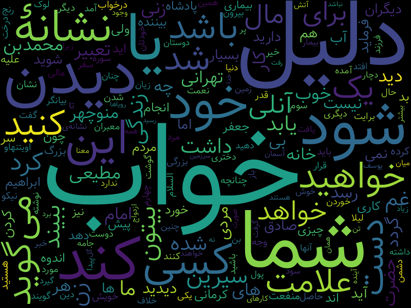

## مقدمه
امروز برای تعطیلات عید به یزد برگشتم و در کتابخانه مادرم، کتاب تعبیر خواب توجهم رو جلب کرد. 

به نظرم تعبیر خواب بیشتر از این که آینده فرد رو نشون بده، گذشته رو نشون میده! به نوعی داره نشون میده که طرف در طول روز به چه چیزهایی فکر می‌کرده. چه مسائلی براش دغدغه بوده. 

خوشبختانه اکثر تعبیر خواب‌هایی که داریم خیلی قدیمی هست پس می‌تونه نماینده خوبی باشه از این که قدیمی‌تر ها چه فکرهایی می‌کردند. 

این مسئله برام جالب بود. البته کاری که می‌خواستم انجام بدم صرفا در حد آنالیز آماری بود. یعنی نمی‌خوام از روش‌های لرنینگ استفاده کنم. صرفا می‌خوام ببینم کدوم لغات پرتکرار هستند و یک «ابر کلمات» درست کنم. 

## کدنویسی
### بررسی دیتاست
برای بررسی ابتدا کتاب «بانک جامع تعبیر خواب» رو [اینجا](https://persianpdf.com/book/%D8%AF%D8%A7%D9%86%D9%84%D9%88%D8%AF-%DA%A9%D8%AA%D8%A7%D8%A8-%D8%A8%D8%A7%D9%86%DA%A9-%D8%AC%D8%A7%D9%85%D8%B9-%D8%AA%D8%B9%D8%A8%DB%8C%D8%B1-%D8%AE%D9%88%D8%A7%D8%A8/) دریافت کردم. بعد با [این سایت](https://www.ilovepdf.com/) فایل PDF رو به Word تبدیل کردم (البته اول سعی کردم با خود ورد تبدیل رو انجام بدم که نشد). 

بعد از اون فایل Word رو به تکست تبدیل کردم ([مرجع](https://stackoverflow.com/questions/36001482/read-doc-file-with-python)). کتابخانه docx2txt خیلی کمک‌کننده بود. Hazm هم که همیشه مفیده. 

> یک زمانی تو پروژه درس NLP یک ابزاری به نام [PrePars](https://github.com/pam-lab/PrePars) توسعه دادیم که می‌خواستیم جایگزین Hazm بکنیم علتش هم این بود که هضم و ابزارهای مشابه، مدت‌هاست که توسعه داده نمیشن. پروژه فعلا رها شده. شاید در آینده توسعه‌اش بدم. نمی‌دونم. الان چیزی در حدود ۶۰ درصدش پیش رفته و هنوز خیلی کار داره. 
> 
> یک چیزی که من روش کار کردم توانایی تشخیص هر فعلی در متن و درست کردن نیم‌فاصله و فاصله در فعل بود. یعنی حتی اگر بهش بگید «داشتمنمیرفتم»، باز هم می‌تونست به «داشتم نمی‌رفتم» تبدیلش کنه! مشکلش این بود که نسبتا کند بود و هنوز کار داره تا سریع بشه. 
> 
> مشکل سرعتش هم به این دلیل بود که یک دیتابیس از تمام فعل‌های فارسی داشتیم که در همون جستجو می‌کردیم و سعی می‌کردیم با نوشتن Regex بتونیم فعل‌ها رو Match کنیم. 
> 
بگذریم. اینجا یه سری پیش‌پردازش اولیه متن رو انجام دادم.

```bash
pip install docx2txt
pip install hazm
```

```python
from collections import Counter
import pandas as pd
import docx2txt
from hazm import Normalizer, WordTokenizer

my_text = docx2txt.process('my_file.docx')

normalizer =Normalizer()
tokenizer = WordTokenizer()
my_text=normalizer.normalize(my_text)
my_text=normalizer.character_refinement(my_text)

words=tokenizer.tokenize(my_text)

```

### حذف StopWordهای فارسی
[کلمات ایست یا StopWordها ](https://en.wikipedia.org/wiki/Stop_word)لغت‌هایی هستند که معمولا قبل از بررسی متن به کل از متن حذف میشن چون تو خروجی نهایی تاثیری ندارند. هیچ لیستی هم نداریم که همه ابزارهای NLP روش توافق داشته باشند. 

البته به طور کلی ترند در NLP این بوده که این مجموعه StopWordها کمتر بشن، تا جایی که بعضی مدل‌ها الان اصلا StopWord در نظر نمی‌گیرند و همه کلمات رو به مدل‌شون میدن. 

این ترند به علت افزایش توانایی مدل‌های NLP هست. مدل‌های قدیمی‌تر (و ساده‌تر) نمی‌تونستند از StopWordها استفاده کنند و مفهوم‌شون رو درک کنند. مدل‌های جدید‌تر (اکثر مبتنی بر ترنسفورمر) می‌تونند تا حدی این‌کار رو انجام بدند. 

تو اینترنت جستجو کردم و روش سازمان‌یافته‌ای برای حذف StopWordهای فارسی پیدا نکردم. منظورم راه‌حلی است که داخل یک کتابخانه استاندارد پیاده‌سازی شده باشه و با صرفا Call کردن قابل استفاده باشه. 

برای این مورد از دو تا ریپازیتوری که که StopWordsهای فارسی رو استخراج کردند استفاده می‌کنم و البته دست از تنبلی برمیدارم و چند خطی کد می‌زنم:

```bash
!git clone https://github.com/kharazi/persian-stopwords
!git clone https://github.com/ziaa/Persian-stopwords-collection
```

این دو تا ریپازیتوری به نظرم لیست کامل و مفیدی دارند. برای این که همه لیست‌هاشون رو یکجا تجمع کنم از کد زیر استفاده می‌کنم:

```python
from pathlib import Path
def file_reader(path):
    return Path(path,encoding='UTF-8').read_text().split()

stop1= file_reader('persian-stopwords/persian') + \
        file_reader('persian-stopwords/verbal') + \
        file_reader('persian-stopwords/nonverbal') + \
        file_reader('persian-stopwords/verbal') + \
        file_reader('persian-stopwords/chars')
        
prefix = 'Persian-stopwords-collection/Stopwords/'
stop2 = file_reader(prefix+ 'Kharazi/Pesian_Stop_Words_List.txt') + \
        file_reader(prefix+ 'Mazdak/Persian_StopList.txt') + \
        file_reader(prefix+'Mojiry/PersianStopWords.txt') + \
        file_reader(prefix+ 'Savoy/persianST.txt') + \
        file_reader(prefix+ 'Taghva/non-verbal_stopwords.txt') + \
        file_reader(prefix+ 'shokri/stop-words.txt')

all = set(stop1 + stop2)

all = set(stop1 + stop2)
```

### کلمات پرتکرار
خب از اینجا بدست آوردن کلمات پرتکرار ساده خواهد بود. 

```python
from collections import Counter
cleaned_list = []
for item in Counter(words).most_common(1000):
    if item[0].strip() not in all:
		cleaned_list.append(item)
```

### مصورسازی
برای مصورسازی از کتابخانه WordCloudFa استفاده کردم ([مرجع](https://virgool.io/Software/%DA%86%DA%AF%D9%88%D9%86%D9%87-%D8%A8%D8%A7-%D9%BE%D8%A7%DB%8C%D8%AA%D9%88%D9%86-%D8%A7%D8%A8%D8%B1%D9%90-%DA%A9%D9%84%D9%85%D8%A7%D8%AA-%D9%81%D8%A7%D8%B1%D8%B3%DB%8C-%D8%A8%D8%B3%D8%A7%D8%B2%DB%8C%D9%85-r71olebo3tgk)). استفاده از کتابخانه ساده است. میشه بهش متن رو داد. میشه هم بهش کلمات و فرکانس‌شون رو داد و بهش بگیم مصورسازی انجام بده. 

انصافا هم کتابخانه‌اش خروجی‌های خوبی میده و قابلیت‌های جالبی داره. 

```python
from wordcloud_fa import WordCloudFa

wc = WordCloudFa(width=800, height=600,persian_normalize=True,
                 include_numbers=False,stopwords=all,no_reshape=True)

freq_dict = {item[0]:item[1] for item in cleaned_list}
word_cloud = wc.generate_from_frequencies(freq_dict)
image = word_cloud.to_image()
image.show()
```

## مشکل روش من
مشکل اصلی این روش تبدیل فایل PDF به Word بود. با این روش بعضی کاراکترها خوب تبدیل نشدند. به همین دلیل بعضی‌ جاها تو تشخیص StopWord ها و فعل‌ها خوب عمل نکردم.

دو تا کار میشد انجام داد که خروجی بهتری بگیرم (که انجام ندادم چون حوصله نداشتم):
- اول این که فایل رو به بخش‌های ۲۰ صفحه‌ای تقسیم کنم و با OCR گوگل به فارسی تبدیلش کنم. OCR فارسی معمولا کیفیت خوبی داره فقط مشکلش اینه که نمیشه فایل‌های حجیم و با صفحات زیاد رو بهش داد. [اینجا](https://modiriran.ir/%D8%AA%D8%A8%D8%AF%DB%8C%D9%84-%D8%B9%DA%A9%D8%B3-%D9%85%D8%AA%D9%86-%DA%AF%D9%88%DA%AF%D9%84-ocr/) کامل‌تر در این مورد توضیح داده. 
- دوم این که میشد دیتا رو خودم خزش کنم. اینکار هم با Scrapy قابل انجام بود. شاید یک زمانی مجددا داده‌های سایت [آکاایران](http://tabirkhab.akairan.com/) رو خزش کنم و با روش‌های بهتری این مسئله رو بررسی کنم. 

## مشاهدات جالب
امروز با دیدن کتاب تعبیر خواب یک فرضیه در ذهنم شکل گرفت. به نظرم اومد قدیمی‌ها به زن، مال، ثروت خیلی فکر می‌کردند. احساس کردم که اکثر دغدغه این کتاب‌ها مسائل شکمی و زیرشکمی بوده. 

البته نتونستم این فرضیه رو تایید کنم. از طرفی نمی‌خوام که داده رو شکنجه بدم که دقیقا چیزی که خودم می‌خوام  رو ازش استخراج کنم. عکس خروجی رو به اشتراک گذاشتم که خودتون قضاوت کنید. 


## پی‌نوشت
کد رو بصورت کامل در [اینجا](https://github.com/pourmand1376/Notebooks/blob/main/Sleep_Analysis.ipynb) قرار دادم. 
