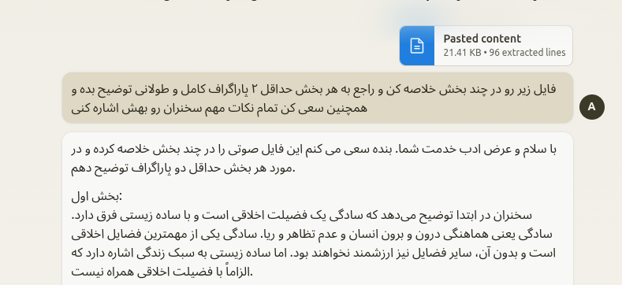
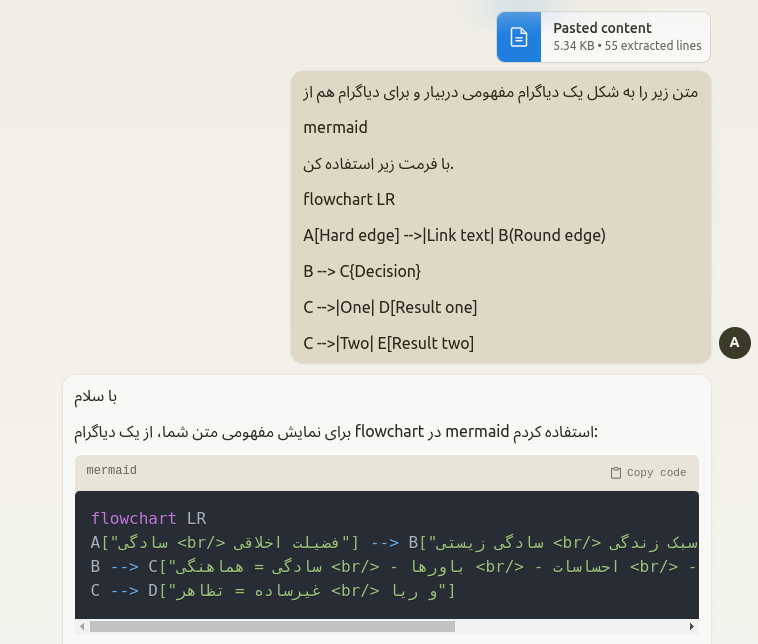

همون‌طور که می‌دونید، الان مدل‌های زبانی بزرگ خیلی قوی شدند و باهاشون میشه کارهای جالبی انجام داد. یکی از این کاربردها که امروز می‌خوام بهش بپردازم، خلاصه‌سازی متن هست.

ماه پیش فایل‌های استاد ملکیان راجع به سادگی و ساده‌زیستی رو گوش دادم. با خودم گفتم خوبه که اول بیام صوت استاد رو با مدل‌های ASR به متن تبدیل کنم و بعد از اون با استفاده از مدل‌های زبانی بزرگ خلاصه‌اش کنم. منظور از مدل ASR همون Automatic Speech Recognition یا بطور خلاصه تبدیل صوت به متن هست.

این پست نتیجه انجام این کار و خروجی من هست. در نظر بگیرید که سعی کردم دخل و تصرفی در متن نداشته باشم و تمام فرآیند اتوماتیک است.

البته برای انتشار چند تا ویرایش بسیار جزئی انجام دادم ولی از چند کلمه فراتر نرفت و تو خروجی نهایی هم چندان مؤثر نبود؛ مثلاً مدل تبدیل صوت به متن به جای ساحت، ساعت نوشته بود و همه خروجی‌های این صفحه (به جای ساحت) ساعت بود :) بنابراین برای کاربردی‌بودن این خلاصه این کلمه رو اصلاح کردم.

## ورودی مدل

ابتدا هر چهار صوت استاد رو یکی یکی به مدل ASR میدم و ازش خروجی متن می‌گیرم که البته خروجی متن رو اینجا هم گذاشتم. خروجی یک فایل متنی، با ۵۰ هزار کلمه و ۵۷ صفحه است.

خروجی رو براتون بصورت [Word](Simplicity.docx) و [PDF](Simplicity.pdf) قرار دادم که بتونید دانلود کنید.

چون متن سخنرانی خیلی طولانیه و مدل نمی‌تونه این همه متن رو بگیره، فایل رو تکه تکه می‌کنم (هر تکه تقریباُ ۶ صفحه متن) و به مدل میدم تا خلاصه‌اش رو بگیرم.

با توجه به این که به شخصه برای خودم محتوای این فایل ها هم مهم بود، محتوای میانی خلاصه شده فایل در هر جلسه رو هم می‌گذارم.

از اینجا به بعد خروجی‌ها کلاً متعلق به مدل زبانی Claude است و نوشته من نیست. فقط در نظر بگیرید که هر جلسه (به علت محدودیت ورودی مدل) به ۳ یا ۴ قسمت تقسیم شده و برای هر قسمت جداگانه خلاصه بدست اومده و خلاصه کل جلسه هم از خروجی کل خلاصه‌ها بدست اومده. 

امیدوارم براتون جالب باشه. 
## خلاصه کل جلسه

با سلام و عرض ادب خدمت شما، متن فوق را در 4 بخش خلاصه می‌کنم و در مورد هر بخش حداقل 2 پاراگراف توضیح می‌دهم:

بخش اول: مقدمه و تعریف سادگی

در ابتدای سخنرانی، سخنران مقدمه‌ای مختصر در مورد موضوع سخنرانی یعنی سادگی ارائه می‌دهد. ایشان سادگی را به عنوان یک فضیلت اخلاقی مهم معرفی می‌کند و توضیح می‌دهد که سادگی به معنای زندگی کردن بر اساس حقیقت درونی خود است، نه بر اساس تصویری که می‌خواهیم از خود ارائه دهیم. سخنران سادگی را مترادف با صداقت، شفافیت، راستگویی و زندگی طبیعی و بدون تکلف می‌داند.

سخنران در این بخش با تعاریف متعدد از سادگی، سعی دارد ابعاد مختلف این مفهوم را برای شنوندگان روشن کند. وی تاکید می‌کند که سادگی یعنی زندگی بدون تظاهر و خودنمایی و بر اساس حقیقت درون. سادگی در تقابل با پیچیدگی‌های غیرضروری و مصنوعی زندگی امروزی قرار دارد و بازگشت به زندگی ساده و طبیعی بشر است.

بخش دوم: دلایل پیچیده شدن زندگی انسان

در این بخش، سخنران به برخی دلایلی که باعث می‌شود زندگی انسان از سادگی دور شده و پیچیده شود، می‌پردازد. از جمله این موارد می‌توان به توجه بیش از حد به نظرات و قضاوت‌های دیگران، تمایل به مقایسه خود با دیگران، تظاهر و جلوه‌گری برای جلب توجه، ابهام‌آمیز کردن سخنان و افکار برای پنهان‌سازی حقیقت و اشتباهات، و تکلف و تجمل‌گرایی اشاره کرد.

سخنران توضیح می‌دهد که این عوامل باعث می‌شوند زندگی انسان از سادگی و صداقت دور شده و دچار پیچیدگی و دورویی شود. از دیدگاه وی، تنها راه بازگشت به سادگی، دوری از این عوامل مخرب و تمرکز بر زندگی مبتنی بر حقیقت درون است. سخنران با طرح این موارد، علل دور شدن انسان امروزی از سادگی را تحلیل می‌کند.

بخش سوم: مزایای سادگی

سخنران در این بخش به برخی از مزایا و فواید سادگی و زندگی ساده برای انسان می‌پردازد. وی معتقد است زندگی ساده باعث حفظ آرامش و شادابی انسان می‌شود. همچنین انسان ساده از یکپارچگی درونی و انسجام فکری برخوردار است و کمتر دچار تردید و سردرگمی می‌شود. علاوه بر اینها، سادگی باعث می‌شود فرد کمتر درگیر تظاهر و خودنمایی شود و همواره خودش باشد.

سخنران با ذکر این موارد، تلاش می‌کند نشان دهد که سادگی چگونه می‌تواند به بهبود کیفیت زندگی انسان و رسیدن به آرامش واقعی کمک کند. وی سادگی را یک راه حل برای بسیاری از معضلات روحی و روانی انسان معاصر معرفی می‌کند.

بخش چهارم: نتیجه‌گیری

در پایان سخنرانی، سخنران بار دیگر بر اهمیت سادگی به عنوان یک فضیلت اخلاقی تأکید می‌کند. وی خاطرنشان می‌سازد که سادگی به معنای ساده‌لوحی و کم‌هوشی نیست بلکه سادگی یعنی زندگی بر اساس حقیقت و بدون تظاهر. سخنران همچنین توصیه می‌کند که برای رسیدن به زندگی ساده باید از الگوها و توقعات غیرواقعی دوری کرد و به جای توجه به دیگران، به حقیقت درون خود توجه نمود.

در نهایت، سخنران مخاطبان را به تفکر در مورد میزان سادگی در زندگی خود ترغیب می‌کند و امیدوار است که آنها گامی عملی برای ساده‌تر کردن زندگی‌شان بردارند. وی سادگی را راهی برای رسیدن به آرامش واقعی معرفی می‌کند.

در مجموع، سخنران در این سخنرانی با تشریح مفهوم سادگی و بیان دلایل دور شدن انسان از آن و همچنین مزایای سادگی، سعی دارد اهمیت این فضیلت اخلاقی را برای مخاطبان روشن کند و آنها را ترغیب به ساده‌تر زیستن نماید.

امیدوارم توضیحات کافی و مفیدی ارائه کرده باشم. در صورت نیاز به توضیح بیشتر در اختیارتان هستم.

### جلسه اول - بخش اول

با توجه به متن سخنرانی، می‌توان آن را به چند بخش تقسیم کرد و خلاصه‌ای از هر بخش ارائه داد:

بخش اول:
سخنران در ابتدا توضیح می‌دهد که بحث امروز و فردای او درباره سادگی و سادگی‌زیستی خواهد بود. او می‌گوید سادگی هم به عنوان پذیرفته و هم به عنوان سبک زندگی مطرح می‌شود. سپس توضیح می‌دهد که سادگی‌زیستی بخشی از سادگی است و کسی که ساده است، سادگی‌زیست هم هست. در پایان نیز اشاره می‌کند که قصد دارد در پایان بحث، تصور روشنی از سادگی و سادگی‌زیستی در ذهن شنوندگان ایجاد کند.

بخش دوم:
سخنران در ادامه توضیح می‌دهد که انسان دارای پنج ساحت است: ساحت باورها، ساحت احساسات و عواطف و هیجانات، ساحت خواسته‌ها، ساحت گفتار و ساحت کردار. سه تای اول ساحت‌های درونی یا باطنی و دوتای بعدی ساحت‌های بیرونی یا ظاهری هستند. او توضیح می‌دهد که روان‌شناسی مطالعه ذهن و رفتار یا منش و شخصیت است.

بخش سوم:
سخنران در ادامه بیان می‌کند که اکثر مردم در طول تاریخ، بود خود را فدای نمود خود کرده‌اند، یعنی می‌خواسته‌اند تصویر زیبایی از خود در ذهن دیگران ایجاد کنند. او تأکید می‌کند که باید به بهسازی خود نه زیباسازی تصویر خود توجه داشت.

بخش چهارم:
در این بخش، سخنران تعاریفی از سادگی ارائه می‌دهد:

- ترجیح بهسازی خود بر زیباسازی تصویر خود
- بی‌توجهی به زیبا و زشت بودن تصویر خود در نزد دیگران
- جلوگیری نکردن از بروز هیچ‌کدام از بودها و هماهنگی نمود با بود
- عدم خودخواهی و خودنمایی
- خودداری از خودسانسوری برای زیبا جلوه دادن خود
- خودباختگی نداشتن در برابر دیگران

بخش پنجم:
در پایان، سخنران تأکید می‌کند که سادگی یعنی خیانت نکردن به خود و با خود در آشتی بودن. او می‌گوید کسی که ساده نیست، به خود خیانت می‌کند و خود را در پای دیگری ضعف می‌دهد.
به این ترتیب، سخنران ضمن بیان مفاهیمی چون بود و نمود، سادگی را به عنوان یک فضیلت اخلاقی معرفی می‌کند که در آن فرد با حفظ حرمت و استقلال خود، رفتاری صادقانه و بدون پیش‌داوری دارد.

### جلسه اول - بخش دوم

با سلام و عرض ادب خدمت شما. بنده سعی می کنم این فایل صوتی را در چند بخش خلاصه کرده و در مورد هر بخش حداقل دو پاراگراف توضیح دهم.

بخش اول:
سخنران در ابتدا توضیح می‌دهد که سادگی یک فضیلت اخلاقی است و با ساده زیستی فرق دارد. سادگی یعنی هماهنگی درون و برون انسان و عدم تظاهر و ریا. سادگی یکی از مهمترین فضایل اخلاقی است و بدون آن، سایر فضایل نیز ارزشمند نخواهند بود. اما ساده زیستی به سبک زندگی اشاره دارد که الزاماً با فضیلت اخلاقی همراه نیست.

سخنران در این بخش، تفاوت مهم میان «سادگی» به عنوان یک فضیلت اخلاقی و «ساده‌زیستی» به عنوان یک سبک زندگی را توضیح می‌دهد. او معتقد است سادگی یعنی هماهنگی و یکپارچگی درون و برون یک انسان، به گونه‌ای که افکار، احساسات و رفتارش در یک راستا باشد. اما ساده‌زیستی صرفاً به سبک زندگی اشاره دارد و لزوماً با فضیلت اخلاقی همراه نیست. سادگی یک فضیلت محوری است که تمام فضایل دیگر باید با آن همراه باشند تا بتوانند به فضیلت تبدیل شوند.

بخش دوم:
سخنران در این بخش به تعریف فضیلت اخلاقی و تفاوت آن با رذیلت اخلاقی می‌پردازد. او می‌گوید فضیلت و رذیلت به حالات درونی انسان مربوط است، نه به رفتار بیرونی. سپس دو دیدگاه متفاوت درباره ماهیت فضیلت را مطرح می‌کند: نخست اینکه فضیلت یعنی انجام دادن کارکرد ویژه هر موجود، و دوم اینکه فضیلت یعنی داشتن احساسات، عواطف و خواسته‌هایی که ذاتاً خوب هستند. سخنران معتقد است دیدگاه دوم درست‌تر است و فضایل اخلاقی محدود به چند مورد خاص هستند که خودشان بدون توجه به متعلّق‌شان خوب محسوب می‌شوند.

در این بخش، سخنران بحث فلسفی عمیقی را درباره مفهوم فضیلت اخلاقی مطرح می‌کند. او معتقد است فضیلت و رذیلت به حالات درونی انسان اشاره دارند، نه به رفتارهای بیرونی. سپس دو دیدگاه فلسفی متفاوت درباره ماهیت فضیلت را مطرح می‌کند که یکی آن را برآمده از انجام کارکرد ویژه هر موجود و دیگری آن را ناشی از داشتن احساسات و عواطفی خاص می‌داند که ذاتاً خوبند. سخنران دیدگاه دوم را می‌پذیرد و معتقد است تعداد محدودی فضیلت اخلاقی وجود دارند که بدون توجه به متعلّق‌شان خوب هستند.

بخش سوم:
در این بخش، سخنران توضیح می‌دهد که چرا سادگی مهم‌ترین فضیلت اخلاقی است. او معتقد است سایر فضایل تنها زمانی ارزش دارند که با سادگی همراه باشند. به عنوان مثال، اگر کسی ظاهراً رفتار میانه‌روانه‌ای داشته باشد اما دروناً میانه‌رو نباشد، دیگر میانه‌رو به حساب نمی‌آید.

سخنران در این بخش بر اهمیت بنیادین سادگی به عنوان مادر فضایل اخلاقی تأکید می‌کند. او معتقد است سایر فضایل اخلاقی مانند وفاداری، بردباری و میانه‌روی تنها زمانی ارزشمندند که با سادگی همراه باشند. یعنی انسان باید نه تنها در رفتار بلکه در افکار و احساساتش نیز وفادار، بردبار و میانه‌رو باشد. در غیر این صورت، صرفاً تظاهر به فضیلت دارد نه خود فضیلت. پس سادگی مادر و شرط لازم تحقق سایر فضایل است.

بخش چهارم:
در این قسمت، سخنران به تفاوت نگرش انسان ساده و غیرساده نسبت به مال و ثروت می‌پردازد. او می‌گوید انسان ساده نسبت به اموال و کالاها نگاهی بی‌تفاوت دارد و آن‌ها را صرفاً ابزار می‌بیند نه هدف. اما انسان غیرساده به مال به عنوان هدف نگاه می‌کند و در پی انباشتن ثروت است. سخنران معتقد است سادگی در نگرش نسبت به مال و ثروت نیز باید وجود داشته باشد تا انسان بتواند فضیلت‌مند بماند.

بخش پنجم:
در بخش پایانی، سخنران به اهمیت سادگی در رابطه با خدا اشاره می‌کند. او می‌گوید انسان ساده در حضور و غیاب خدا هیچ تفاوتی با خود نشان نمی‌دهد. اما اغلب مومنان در دعا و نیایش، رفتاری غیر از آنچه در درون دارند به نمایش می‌گذارند. سخنران تأکید می‌کند که رابطه با خدا نیز باید از سادگی برخوردار باشد.

در پایان، سخنران به لزوم سادگی حتی در رابطه با خدا اشاره می‌کند. او معتقد است انسان ساده در حضور و غیاب خدا هیچ تفاوتی با خود نشان نمی‌دهد اما مومنان اغلب در دعا و نیایش رفتاری متفاوت با آنچه در درون دارند به نمایش می‌گذارند. سخنران تأکید می‌کند که رابطه با خدا نیز باید از سادگی و صداقت برخوردار باشد تا فضیلت‌مندانه باشد.

در مجموع، سخنران در این فایل صوتی به تشریح اهمیت سادگی به عنوان مهم‌ترین فضیلت اخلاقی می‌پردازد که در تمام عرصه‌های زندگی انسان، از جمله رابطه با مال و ثروت و حتی با خدا، باید وجود داشته باشد تا سایر فضایل معنا پیدا کنند.

### جلسه دوم - بخش اول

با سلام و عرض ادب خدمت شما. این فایل را می‌توان در چند بخش خلاصه کرد:

بخش اول (زمان 0 تا 123 ثانیه):

در این بخش، سخنران در مورد مفهوم «سادگی» صحبت می‌کند. ایشان می‌گوید سادگی دو بعد دارد: بعد اخلاقی و بعد روش‌شناختی. در بعد اخلاقی، سادگی یعنی توجه کامل به بهبود باورها، احساسات، عواقب و خواسته‌ها، یعنی باورها بهتر، احساسات و عواقب بجاتر و خواسته‌های معقول‌تر. در بعد روش‌شناختی هم سادگی یعنی رفتار آدم باید کاملا متناسب با اصلاح درونی‌اش باشد.

بخش دوم (زمان 123 تا 246 ثانیه):

در این قسمت سخنران در مورد این صحبت می‌کند که منظور او از سادگی دو بعدی، توجه‌کردن به اصلاح درون و همچنین بیان صادقانه و بی‌ریای آنچه در درون است، می‌باشد. اما برخی از شنوندگان تنها به بعد روش‌شناختی توجه کرده‌اند و گفته‌اند که شما دارید توصیه می‌کنید هرچیزی را که در درون دارید بیرون بریزید. در حالی که سخنران تاکید داشته که انسان باید همواره در تلاش برای اصلاح درون باشد و در عین حال آنچه در درون است را بی‌ریا بیان کند.

بخش سوم (زمان 246 تا 459 ثانیه):

در این بخش، سخنران توضیح می‌دهد که منظور از سادگی این نیست که انسان به هر زشتی و ناراستی درونی‌اش راضی باشد، بلکه انسان باید همواره در تلاش برای اصلاح درون باشد، اما در عین حال آنچه در هر لحظه در درونش هست را بدون ریا بیان کند. مثلا وقتی غمگین است، نباید ظاهرا خوشحال به نظر برسد. باید غم درونی‌اش را بیان کند تا فاصله‌ای میان بود و نمودش نباشد. اما همزمان در پی اصلاح درون و رسیدن به شادی هم باشد.

بخش چهارم (زمان 459 تا 642 ثانیه):

در این قسمت سخنران مثالی می‌زند در مورد کسی که درونش غمگین است اما ظاهرا می‌خندد. ایشان می‌گوید این شخص سادگی ندارد چون بود و نمودش مطابقت ندارد. اما اگر فردی درونش غمگین باشد و ظاهرا هم غمگینی‌اش را نشان دهد، ولی همزمان در پی رسیدن به شادی درونی باشد، در این صورت سادگی دارد.

بخش پنجم (زمان 642 تا 972 ثانیه):

در این بخش سخنران در مورد این صحبت می‌کند که سادگی یعنی انسان همواره در حال اصلاح درون خود باشد، اما در عین حال آنچه در هر لحظه در درون دارد را بیان کند. مثلا اگر الان غمگین است، غمگینی‌اش را نشان دهد، نه اینکه ظاهرا خوشحال باشد. سخنران در پاسخ به یک سوال هم توضیح می‌دهد که گاهی در متون دینی توصیه شده است که اگر درونت مثلا خشمگین است، ظاهرا رفتار ملایم داشته باشی تا درونت هم ملایم شود. اما سخنران معتقد است این درست نیست و رفتار بیرونی نمی‌تواند درون را تغییر دهد.

بخش ششم (زمان 972 تا 1302 ثانیه):

در این قسمت سخنران در پاسخ به سوالی که مطرح شده، توضیح می‌دهد که حتی اگر فرض کنیم آن آموزه‌ی اصلاح درون از راه رفتار بیرونی درست باشد، باز هم اگر کسی بخواهد رفتارش را مثلاً ملایم کند تا درونش ملایم شود، این رفتار با سادگی منافات ندارد. چون این شخص دو باور دارد: یکی اینکه درونش بردبار نیست، دوم اینکه یکی از راه‌های بردبار شدن، رفتار بردبارانه است.

پس رفتار بیرونی‌اش با باورهای درونی‌اش همخوانی دارد و بنابراین سادگی ندارد. تنها زمانی رفتارش با سادگی منافات پیدا می‌کند که مثلاً بخواهد صرفاً برای مقبول جلوه دادن خودش، رفتار بردبارانه‌ای از خود بروز دهد.

بخش هفتم (زمان 1302 تا پایان):

در این بخش نهایی، سخنران جمع‌بندی می‌کند که سادگی دو بُعد دارد: یکی اصلاح مداوم درون و دیگری بیان صادقانه‌ی آنچه در هر لحظه در درون هست. او مجدداً تأکید می‌کند که نباید به زشتی‌های درونی خود تن داد، بلکه باید همواره در پی اصلاح آن بود، اما در عین حال بدون ریا آنچه را در درون است بیان کرد.

امیدوارم توانسته باشم خلاصه مناسبی از مطالب ارائه دهم. در صورت نیاز به توضیح بیشتر در هر بخشی، در خدمتم.

### جلسه دوم - بخش دوم

با سلام و عرض ادب. فایل را می‌توان به چند بخش تقسیم کرد:

بخش اول: توضیح در مورد اینکه تمام وقت و انرژی ما صرف کسب مال و ثروت بیش از نیازمان می‌شود و این باعث می‌شود وقتی برای تحقق رویاهایمان نداشته باشیم. سخنران توضیح می‌دهد که ما فقط به چند مورد اساسی مثل غذا، پوشاک، مسکن و سوخت نیاز داریم ولی مشغول تحصیل و حفظ مال و ثروت بیشتر از نیازمان هستیم. این باعث می‌شود وقتمان برای تحقق رویاهایمان گرفته شود.

بخش دوم: توضیح در مورد اینکه نگاه دیگران باعث می‌شود ما بیش از نیازمان کالا و خدمات مصرف کنیم تا در نظر دیگران خوب به نظر برسیم. سخنران مثال‌هایی از پوشاک، خوراک، مسکن و وسایل زندگی می‌زند که چگونه به خاطر نگاه دیگران، بیش از نیاز خریداری می‌کنیم تا در نظرشان خوب و موفق به نظر برسیم.

بخش سوم: تاکید بر اینکه باید ساده‌زیست بود و به جای توجه به نظر و نگاه دیگران، به رویاها و آرزوهای درونی خودمان توجه کرد. سخنران تاکید می‌کند که اگر می‌خواهیم به رویاهایمان برسیم باید ساده‌زیست باشیم و فقط به نیازهای اساسی زندگی توجه داشته باشیم نه نظر دیگران.

بخش چهارم: ارائه راهکار برای ساده‌زیستی و رسیدن به رویاها. سخنران پیشنهاد می‌کند که با توجه فقط به نیازهای اساسی، می‌توانیم با کمتر کار کردن هم زندگی کنیم و وقتمان را صرف رویاهایمان کنیم. او توصیه می‌کند سهم مال و ثروت را در زندگی‌مان کم کنیم تا بتوانیم به رویاهایمان برسیم.

به طور کلی، سخنران با طرح این موضوع که ما بیش از حد درگیر کسب ثروت و توجه به نگاه دیگران هستیم، سعی می‌کند مخاطب را ترغیب کند که با ساده‌زیستی و تمرکز بر رویاهای درونی‌اش، به زندگی بهتر و رضایت‌بخش‌تری دست پیدا کند.

### جلسه دوم - بخش سوم

با توجه به فایل صوتی ارائه شده، می‌توان آن را در چند بخش خلاصه کرد:

بخش اول:
در این بخش، سخنران در مورد لزوم ساده زیستی و کاهش امیال و خواسته‌های غیرضروری در زندگی صحبت می‌کند. او بیان می‌کند که انسان‌ها عموماً شب‌ها به دلیل حسرت و پشیمانی ناشی از عدم تحقق آرزوهایشان، دچار بی‌خوابی می‌شوند. بنابراین او توصیه می‌کند که ما باید انتظارات و خواسته‌های غیرضروری‌مان را کاهش دهیم تا بتوانیم شب‌ها به راحتی به خواب رویم.

سخنران همچنین به نقل قولی از یوگاناندا، رهبر معنوی هندو، اشاره می‌کند که چطور مردم ساده‌زیست هندی می‌توانند با وجود فقر شب‌ها راحت بخوابند، در حالی که مردم ثروتمند آمریکایی با وجود امکانات رفاهی نمی‌توانند. او این موضوع را به دلیل سادگی و انتظارات پایین مردم هندی می‌داند.

بخش دوم:
در این بخش، سخنران در مورد چند مرحله برای ساده زیستی صحبت می‌کند. اول اینکه باید تشخیص دهیم چه چیزهایی واقعاً برای زندگی ما ضروری هستند و چه چیزهایی غیرضروری هستند. بعد از تفکیک این دو، باید غیرضروری‌ها را از زندگی خود حذف کنیم. سپس، حتی اگر چیزی غیرضروری به ما هدیه شد، نباید آن را بپذیریم چرا که نگهداری آن زمان و انرژی ما را خواهد گرفت.

سخنران همچنین به زندگی ویتگنشتاین اشاره می‌کند که پس از مرگ پدرش، بخش زیادی از ثروت و املاک ارثی‌اش را رد کرد تا بتواند ساده‌تر زندگی کند و به رشد فکری و معنوی خود بپردازد.

بخش سوم:
در بخش پایانی، سخنران تأکید می‌کند که ساده زیستی به معنای استقلال و رهایی از وابستگی به دیگران است. او می‌گوید کسی که ساده زندگی می‌کند، نیازهای اولیه‌اش را خودش تأمین می‌کند و وابسته به دیگران نیست. همچنین می‌گوید ساده زیستی باعث می‌شود تمرکز ما روی رشد درونی و معنوی باشد نه روی شهرت، ثروت و جایگاه اجتماعی. در نهایت، سخنران ساده زیستی را یکی از مهم‌ترین راه‌های رسیدن به آرامش و سعادت می‌داند.

### جلسه سوم - بخش اول

با سلام و عرض ادب، فایل صوتی با موضوع سادگی را می‌توان به چند بخش تقسیم کرد:

بخش اول: مقدمه
در ابتدای فایل، سخنران به معرفی خودش پرداخته و اشاره می‌کند که قرار است در این جلسه و جلسات بعدی در مورد موضوع سادگی صحبت کند. او سپس توضیح می‌دهد که در جلسه قبلی در مورد سادگی زیستی بحث کرده و در این جلسه قرار است در مورد سایر ابعاد سادگی صحبت شود.

بخش دوم: تعارض مصرف‌گرایی و سادگی زیستی
سخنران در این بخش بیان می‌کند که سادگی زیستی در تقابل کامل با مصرف‌گرایی است و اگر جامعه‌ای ساده‌زیست باشد، مصرف‌گرایی به صفر می‌رسد. او توضیح می‌دهد که اگر مصرف‌گرایی نباشد، بسیاری از مشکلات و منازعات اجتماعی نیز از بین می‌رود.

بخش سوم: ویژگی‌های انسان ساده
در این بخش سخنران ویژگی‌های مختلف انسان ساده را برمی‌شمارد:

- انسان ساده در مورد خودش صحبت نمی‌کند و خود را مطرح نمی‌کند.
- با وجود سکوت در مورد خود، انسان ساده برای دیگران کاملاً شفاف است، چرا که ظاهر و باطنش یکی است.
- انسان ساده در انجام کارهایش به‌طور کامل حضور دارد و تمرکزش را از دست نمی‌دهد.
- ستایش و نکوهش دیگران در انسان ساده اثری ندارد.
  در مجموع، سخنران تلاش می‌کند نشان دهد انسان ساده کسی است که بر بود خودش متمرکز است و نسبت به نظرات و قضاوت‌های دیگران بی‌تفاوت است. او در پایان سعی می‌کند شنوندگان را تشویق کند که خود را ارزیابی کرده و ببینند چقدر سادگی در زندگی‌شان وجود دارد.

### جلسه سوم - بخش دوم

با سلام، متن را در 3 بخش خلاصه می‌کنم و درباره هر بخش حداقل 2 پاراگراف توضیح می‌دهم:

بخش اول:
این بخش درباره مفهوم توازن و درون‌گرایی در یک انسان کامل است. سخنران می‌گوید یک انسان کامل هم توزین‌گر است و هم توزین شده. یعنی هم خودش توزین می‌کند و هم توسط دیگران توزین می‌شود. او می‌فهمد که دیگران درباره‌اش چه می‌گویند ولی خودش در مقابل نظرات مثبت یا منفی دیگران واکنش احساسی نشان نمی‌دهد. انسان کامل نیازی به دلیل‌تراشی ندارد و صرفاً با عقل و استدلال عمل می‌کند.

بخش دوم:
در این بخش، سخنران توضیح می‌دهد که دلیل‌تراشی یعنی ابتدا یک باور یا احساس بدون دلیل پذیرفته می‌شود، اما بعداً برای آن دلیل و استدلال ساختگی تراشیده می‌شود تا در نظر دیگران منطقی و عقلانی به نظر برسد. این در مقابل استدلال منطقی است که ابتدا دلایل را بررسی می‌کند و بعد یک باور را می‌پذیرد. انسان ساده اگر باوری بی‌دلیل داشته باشد، آن را می‌پذیرد و در پی دلیل‌تراشی نیست.

بخش سوم:
سخنران در این بخش به اهمیت سادگی و بی‌ریایی در انسان کامل اشاره می‌کند. انسان ساده در پی متقاعد کردن دیگران نیست و صرفاً تجربه خود را به اشتراک می‌گذارد. او دانش خود را در اختیار دیگران قرار می‌دهد تا آگاهانه تصمیم بگیرند اما خودش برای آنها تصمیم‌گیری نمی‌کند. انسان ساده کسی است که همواره دنبال حکمت و دانش مفید برای زندگی عملی خود است و اهل بحث‌های بی‌فایده و جدل‌های بی‌مورد نیست.

### جلسه سوم - بخش سوم

با سلام و عرض ادب خدمت شما

متن فایل صوتی را می‌توان به چند بخش تقسیم کرد:

بخش اول:
در این بخش، سخنران در مورد اهمیت توجه به سوالاتی که به زندگی عملی ما مربوط می‌شود، صحبت می‌کند. ایشان معتقد است که باید سوالاتی را دنبال کنیم که سه ویژگی داشته باشند: اول اینکه پاسخ دادن به آن سوال در زندگی عملی ما تاثیر بگذارد، دوم اینکه اگر سوال بی پاسخ بماند در زندگی عملی ما تاثیر بگذارد و سوم اینکه اگر پاسخ سوال متفاوت باشد، در زندگی عملی ما تفاوت ایجاد کند. سخنران معتقد است که اگر سوالی این سه ویژگی را نداشته باشد، نه تنها وظیفه نداریم که دنبال پاسخ آن باشیم بلکه حتی حق نداریم دنبالش باشیم.

بخش دوم:  
در این بخش، سخنران به بررسی آموزش‌هایی که در طول زندگی دریافت کرده‌ایم می‌پردازد. ایشان معتقد است که اکثر آموزش‌های مدرسه و دانشگاه ما از جمله دروسی مثل ریاضی، فیزیک، شیمی، تاریخ و جغرافیا به زندگی عملی ما ربطی ندارد و در حل مسائل واقعی زندگی ما کمکی نمی‌کند. پس این دروس در زمره دانش بی‌فایده قرار می‌گیرند. سخنران معتقد است کاش این‌گونه دروس را اصلاً نخوانده بودیم.

بخش سوم:
در این قسمت، سخنران تأکید می‌کند که توجه به نمود و ظاهر، یکی از دلایل اصلی یادگیری بسیاری از دانش‌های بی‌فایده است. ایشان معتقد است که ما اغلب برای زیباتر جلوه دادن نمود خودمان، دانش‌هایی را فرا می‌گیریم که هیچ کمکی به حل مشکلات واقعی ما نمی‌کند. سخنران تأکید می‌کند که باید توجه خود را معطوف به بود خویش کنیم و نه نمود خود.

بخش چهارم:
در پایان، سخنران بار دیگر بر ضرورت توجه به «حکمت به من چه» تأکید می‌کند. ایشان معتقد است که باید فقط به دنبال پاسخ سوالاتی باشیم که برای زندگی عملی ما مفید است و سوالات بی‌ربط را کنار بگذاریم. سخنران سادگی را یکی دیگر از ابعاد حکمت به من چه می‌داند.

به طور کلی، سخنران در این سخنرانی بر لزوم تمرکز بر دانش‌ها و مهارت‌های مفید برای زندگی عملی تأکید دارد و معتقد است که نباید وقت و انرژی خود را صرف یادگیری مطالب بی‌ربط و بی‌فایده کنیم.

### جلسه چهارم - بخش اول

با سلام و عرض ادب خدمت شما، کوشش می‌کنم فایل صوتی را خلاصه کرده و درباره محتوای آن توضیحات مفصلی ارائه دهم.

بخش اول (۰ تا ۳۳۲ ثانیه):

در این بخش، سخنران درباره مفهوم سادگی و جنبه‌های مختلف آن صحبت می‌کند. وی تأکید می‌کند که انسان‌های ساده نه تکبّر دارند و نه شکست نفسی، بلکه تنها به بود خود توجه دارند نه نمود. سخنران توضیح می‌دهد که تکبّر و شکست نفسی هر دو به مقام نمود مربوط می‌شوند، نه به بود. او معتقد است که اگر انسان تنها به بود خود توجه داشته باشد، دیگر نمی‌تواند متکبّر شود یا خود را حقیر ببیند.

بخش دوم (۳۳۳ تا ۶۷۶ ثانیه):

در این بخش، سخنران بحث فلسفی‌تری را مطرح می‌کند. او توضیح می‌دهد که برای مقایسه دو چیز و قضاوت درباره برتری یکی نسبت به دیگری، باید هر دو در میدان آگاهی فرد قرار بگیرند. اما از آنجا که انسان تنها نسبت به بود خودش آگاهی دارد، نمی‌تواند خود را با دیگران مقایسه کند. بنابراین نه می‌تواند متکبّر شود و نه حقیر انگاری کند.

بخش سوم (۶۷۷ تا ۱۰۳۸ ثانیه):

در این قسمت، سخنران یک نمونه از ادبیات دینی را ذکر می‌کند که در آن فردی از خدا درخواست می‌کند که خدا او را برترین بندگان بداند، خودش خود را فروترین بندگان ببیند و دیگران او را مثل خودشان بدانند. سخنران توضیح می‌دهد که این دعا نشان‌دهنده مضرّات تکبّر و شکست نفسی است و درخواست برابری و مساوات در نگاه دیگران.

بخش چهارم (۱۰۳۹ تا ۱۲۱۹ ثانیه):

سخنران در این بخش بیان می‌کند که مقایسه خود با دیگران نه تنها از نظر اخلاقی بلکه از نظر فلسفی نیز منطقی نیست، چرا که انسان‌ها از یک نقطه شروع مشترک آغاز به زندگی نمی‌کنند. بنابراین مقایسه آن‌ها بی‌معناست مگر اینکه همه در یک شرایط مشابه قرار داشته باشند.

به طور کلی، سخنران در این فایل صوتی بر مفهوم سادگی و پرهیز از مقایسه خود با دیگران تأکید دارد. او با استدلال‌های فلسفی و مثال‌هایی از متون دینی، نشان می‌دهد که چرا مقایسه انسان‌ها بی‌معناست و می‌تواند موجب تکبّر یا شکست‌نفسی شود. پیام اصلی سخنران این است که انسان‌های ساده تنها به بود خود توجه می‌کنند و از مقایسه‌های بیهوده دوری می‌جویند.

### جلسه چهارم - بخش دوم

با سلام و عرض ادب خدمت شما. متن فوق درباره سادگی در تفکر، گفتار و رفتار است که در 4 بخش اصلی می‌توان آن را خلاصه کرد:

بخش 1 - سادگی در تفکر

- تفکر ساده یعنی فکر کردن به ساده‌ترین و کوتاه‌ترین شیوه ممکن. انسان ساده فقط به اندازه‌ای فکر می‌کند که به نتیجه برسد، نه کمتر و نه بیشتر.
- تفکر ساده همیشه با زبانی ساده و روشن در ذهن انجام می‌شود و هرگز مبهم نیست.
- انسان ساده در تفکر، هیچ‌وقت خود را با دیگران مقایسه نمی‌کند و به نتیجه این مقایسه‌ها هم توجه نمی‌کند. او تنها وضعیت موجود خود را می‌پذیرد.

بخش 2 - سادگی در گفتار

- سخن انسان ساده نه خیلی کوتاه و نه خیلی طولانی است، بلکه در حد ضرورت بیان می‌شود.
- سخن او واضح و روشن است و ابهام یا ایهام ندارد.
- انسان ساده سخن خود را بر اساس سطح درک مخاطب تنظیم می‌کند و از به کار بردن الفاظ نامفهوم برای مخاطب پرهیز می‌کند.
- سخن او همیشه به‌جا و مرتبط با موضوع است و بیهوده طولانی نمی‌شود.

بخش 3 - سادگی در رفتار

- رفتار انسان ساده تابع احساسات درونی اوست، نه تظاهر و تصنع.
- او در رفتارش شفافیت دارد و هیچ‌گاه نقاب بر چهره نمی‌زند یا خود را غیرآنچه هست نشان نمی‌دهد.
- رفتار او صادقانه، بی‌ریا و بدون تزویر است.
- انسان ساده در رفتارش نسبت به همه یکسان و بی‌طرف است و تبعیض قائل نمی‌شود.

به‌طور کلی، سخنران در این متن بر لزوم سادگی و صداقت در تفکر، گفتار و رفتار تأکید دارد و معتقد است انسان ساده کسی است که بین باطن و ظاهر خود تفاوت قائل نمی‌شود.

### جلسه چهارم - بخش سوم

با سلام

متن بالا را می‌توان به چند بخش تقسیم کرد:

بخش اول) تعریف سادگی و انواع آن

در این بخش، سخنران تعاریف مختلفی از سادگی ارائه می‌دهد. از جمله اینکه سادگی یعنی زندگی کردن مطابق با خود واقعی فرد و نه آنچه به نظر می‌رسد. همچنین سادگی به معنای صداقت و راستگویی، شفافیت، زندگی مطابق با فطرت و ذات آدمی، و غیره تعریف می‌شود. سپس سخنران به انواع سادگی اشاره می‌کند مانند سادگی درونی و بیرونی.

بخش دوم) عواملی که باعث پیچیده شدن زندگی می‌شوند

در این بخش، سخنران به برخی عواملی که باعث می‌شوند زندگی انسان پیچیده و مبهم شود، اشاره می‌کند. از جمله توجه بیش از حد به دیگران و نظرات آنها، مقایسه با دیگران، تظاهر و جلوه‌گری، ابهام‌آمیز کردن سخنان و افکار به منظور پنهان کردن اشتباهات، و غیره.

بخش سوم) مزایای سادگی و زندگی ساده

در این بخش، سخنران به مزایا و فواید زندگی ساده برای انسان اشاره می‌کند. از جمله اینکه زندگی ساده باعث آرامش، شادی، یکپارچگی درونی، عدم تزلزل، و غیره می‌شود. همچنین فرد ساده همواره خودش است و نقاب به چهره نمی‌زند.

در کل، سخنران تلاش می‌کند نشان دهد که سادگی یک فضیلت بزرگ اخلاقی است و باعث می‌شود انسان به آرامش و سعادت برسد. البته سادگی به معنای ساده‌لوحی و بی‌تدبیری نیست.

امیدوارم خلاصه مناسبی ارائه کرده باشم. در صورت نیاز به توضیح بیشتر در هر بخش، آماده‌ام پاسخگو باشم.

## پی‌نوشت

می‌خواستم برای کل جلسه با استفاده از mermaid و مدل‌های زبانی یک سری نمودار هم تولید کنم که اولاً حوصله‌ام نشد و ثانیاً دیدم که چندان خوب نمی‌تونه خروجی تولید کنه.
